# 🤖 Agent Flows Overview

**Complete Agent Architecture - How Each Agent Works**

---

## Overview

This document provides a comprehensive view of all 6 agents in the Weather Insights and Forecast Advisor system, showing how each agent accomplishes its goals through a simplified flow diagram.

**Perfect for:**
- Quick reference during demos
- Understanding agent responsibilities
- Explaining the multi-agent architecture
- Training and onboarding

---

## 1. 🚨 Alerts Snapshot Agent

**Purpose:** Load and display severe weather alerts with map visualization

```mermaid
%%{init: {'theme':'base', 'themeVariables': { 'fontSize':'20px', 'fontFamily':'arial'}}}%%
graph LR
    subgraph Input1["📥 INPUT"]
        UserRequest1["User Request:<br/>'Get severe weather alerts'"]
    end
    
    subgraph AlertsAgent["🚨 ALERTS SNAPSHOT AGENT"]
        direction TB
        
        subgraph Step1A["STEP 1: Retrieval"]
            Retriever["<br/>alerts_retriever_agent<br/><br/>🎯 Goal: Get top alerts<br/><br/>Actions:<br/>1️⃣ Call get_nws_alerts<br/>2️⃣ Filter by severity<br/>3️⃣ Limit to top 5<br/>4️⃣ Extract zone IDs<br/><br/>Output: alerts + zone_ids<br/><br/>"]
        end
        
        subgraph Step2A["STEP 2: Coordination"]
            Coordinator["<br/>alerts_coordinator_agent<br/><br/>🎯 Goal: Enrich with coordinates<br/><br/>Actions:<br/>1️⃣ Read alerts from state<br/>2️⃣ For each zone_id:<br/>   • Call get_zone_coordinates<br/>   • Calculate centroid<br/>3️⃣ Create map markers<br/>4️⃣ Generate summary<br/><br/>Output: AlertsSnapshot<br/><br/>"]
        end
        
        Step1A --> Step2A
    end
    
    subgraph Output1["📤 OUTPUT"]
        Response1["AlertsSnapshot:<br/>• 5 severe alerts<br/>• Map markers (lat/lng)<br/>• Summary text"]
    end
    
    UserRequest1 --> Step1A
    Step2A --> Response1
    
    style Input1 fill:#e3f2fd,stroke:#1976d2,stroke-width:3px
    style AlertsAgent fill:#ffebee,stroke:#c62828,stroke-width:4px
    style Step1A fill:#fff3e0,stroke:#f57c00,stroke-width:2px
    style Step2A fill:#e8f5e9,stroke:#388e3c,stroke-width:2px
    style Output1 fill:#f3e5f5,stroke:#7b1fa2,stroke-width:3px
```

**Key Insight:** Two-stage pipeline - first retrieve and filter alerts, then enrich with geographic data for mapping.

---

## 2. 🌤️ Forecast Agent

**Purpose:** Provide 7-day and hourly weather forecasts for any location

```mermaid
%%{init: {'theme':'base', 'themeVariables': { 'fontSize':'20px', 'fontFamily':'arial'}}}%%
graph LR
    subgraph Input2["📥 INPUT"]
        UserRequest2["User Request:<br/>'Get forecast for Tampa, FL'"]
    end
    
    subgraph ForecastAgent["🌤️ FORECAST AGENT"]
        direction TB
        
        subgraph Step1B["STEP 1: Geocoding"]
            Geocode["<br/>🎯 Goal: Convert location to coordinates<br/><br/>Tool: geocode_address<br/><br/>Action:<br/>• Call Google Maps API<br/>• 'Tampa, FL' → lat/lng<br/><br/>Output: 27.95, -82.45<br/><br/>"]
        end
        
        subgraph Step2B["STEP 2: Grid Lookup"]
            Grid["<br/>🎯 Goal: Get NWS grid point<br/><br/>Tool: get_nws_forecast<br/><br/>Action:<br/>• Call NWS /points API<br/>• Get gridId, gridX, gridY<br/><br/>Output: TBW/64/68<br/><br/>"]
        end
        
        subgraph Step3B["STEP 3: Fetch Forecasts"]
            Fetch["<br/>🎯 Goal: Get weather data<br/><br/>Tools: get_nws_forecast,<br/>get_hourly_forecast<br/><br/>Actions:<br/>• Get 7-day forecast (14 periods)<br/>• Get hourly forecast (48 hours)<br/>• Group day/night periods<br/><br/>Output: ForecastData<br/><br/>"]
        end
        
        Step1B --> Step2B
        Step2B --> Step3B
    end
    
    subgraph Output2["📤 OUTPUT"]
        Response2["ForecastData:<br/>• Location info<br/>• 7-day forecast<br/>• 48-hour hourly<br/>• Weather details"]
    end
    
    UserRequest2 --> Step1B
    Step3B --> Response2
    
    style Input2 fill:#e3f2fd,stroke:#1976d2,stroke-width:3px
    style ForecastAgent fill:#fff9c4,stroke:#f57f17,stroke-width:4px
    style Step1B fill:#e1f5fe,stroke:#0277bd,stroke-width:2px
    style Step2B fill:#f3e5f5,stroke:#7b1fa2,stroke-width:2px
    style Step3B fill:#e8f5e9,stroke:#388e3c,stroke-width:2px
    style Output2 fill:#fff3e0,stroke:#f57c00,stroke-width:3px
```

**Key Insight:** Three-step sequential process - geocode location, find NWS grid, then fetch both daily and hourly forecasts.

---

## 3. 🌀 Hurricane Simulation Agent

**Purpose:** Analyze hurricane satellite images and generate evacuation priorities

```mermaid
%%{init: {'theme':'base', 'themeVariables': { 'fontSize':'20px', 'fontFamily':'arial'}}}%%
graph LR
    subgraph Input3["📥 INPUT"]
        UserRequest3["User Action:<br/>Uploads hurricane<br/>satellite image"]
    end
    
    subgraph HurricaneAgent["🌀 HURRICANE SIMULATION AGENT"]
        direction TB
        
        subgraph Step1C["STEP 1: Image Analysis"]
            ImageAnalysis["<br/>hurricane_image_analysis_agent<br/><br/>🎯 Goal: Extract hurricane metadata<br/><br/>AI: Gemini Vision API<br/><br/>Actions:<br/>1️⃣ Analyze satellite image<br/>2️⃣ Detect hurricane category (1-5)<br/>3️⃣ Identify affected states<br/>4️⃣ Extract bounding box<br/><br/>Output: HurricaneData<br/>(category, states, coordinates)<br/><br/>"]
        end
        
        subgraph Step2C["STEP 2: Evacuation Planning"]
            EvacCoordinator["<br/>evacuation_coordinator_agent<br/><br/>🎯 Goal: Prioritize evacuation zones<br/><br/>Tools: get_flood_risk_data,<br/>calculate_evacuation_priority<br/><br/>Actions:<br/>1️⃣ For each affected state:<br/>   • Query flood risk data (BigQuery)<br/>   • Get historical events<br/>2️⃣ Calculate risk scores:<br/>   • Base risk = category × 2<br/>   • Add flood severity<br/>3️⃣ Deduplicate coordinates<br/>4️⃣ Sort by risk, limit to top 20<br/><br/>Output: EvacuationPlan<br/><br/>"]
        end
        
        Step1C --> Step2C
    end
    
    subgraph Output3["📤 OUTPUT"]
        Response3["EvacuationPlan:<br/>• Top 20 high-risk locations<br/>• Risk scores<br/>• Affected states<br/>• AI insights<br/>• Recommendations"]
    end
    
    UserRequest3 --> Step1C
    Step2C --> Response3
    
    style Input3 fill:#e3f2fd,stroke:#1976d2,stroke-width:3px
    style HurricaneAgent fill:#ffebee,stroke:#c62828,stroke-width:4px
    style Step1C fill:#fff3e0,stroke:#f57c00,stroke-width:2px
    style Step2C fill:#e8f5e9,stroke:#388e3c,stroke-width:2px
    style Output3 fill:#f3e5f5,stroke:#7b1fa2,stroke-width:3px
```

**Key Insight:** Combines AI Vision (Gemini) for image analysis with historical data (BigQuery) to create data-driven evacuation priorities.

---

## 4. 🏥 Emergency Resources Agent

**Purpose:** Find nearby emergency facilities (shelters, hospitals, pharmacies)

```mermaid
%%{init: {'theme':'base', 'themeVariables': { 'fontSize':'20px', 'fontFamily':'arial'}}}%%
graph LR
    subgraph Input4["📥 INPUT"]
        UserRequest4["User Request:<br/>'Find shelters in Tampa, FL<br/>within 10 miles'"]
    end
    
    subgraph EmergencyAgent["🏥 EMERGENCY RESOURCES AGENT"]
        direction TB
        
        subgraph Step1D["STEP 1: Geocoding"]
            Geocode4["<br/>🎯 Goal: Convert location to coordinates<br/><br/>Tool: geocode_address<br/><br/>Action:<br/>• Call Google Maps API<br/>• 'Tampa, FL' → lat/lng<br/><br/>Output: 27.95, -82.45<br/><br/>"]
        end
        
        subgraph Step2D["STEP 2: Search Resources"]
            Search["<br/>🎯 Goal: Find nearby facilities<br/><br/>Tool: search_nearby_places<br/><br/>Actions:<br/>• Query Google Places API<br/>• Type: shelters/hospitals/pharmacies<br/>• Radius: 10 miles (16 km)<br/>• Get top results<br/><br/>Output: List of facilities<br/><br/>"]
        end
        
        subgraph Step3D["STEP 3: Generate Map"]
            MapGen["<br/>🎯 Goal: Create interactive map<br/><br/>Tool: generate_map<br/><br/>Actions:<br/>• Create markers for each facility<br/>• Add facility details<br/>• Set map center<br/>• Generate map URL<br/><br/>Output: EmergencyResources<br/><br/>"]
        end
        
        Step1D --> Step2D
        Step2D --> Step3D
    end
    
    subgraph Output4["📤 OUTPUT"]
        Response4["EmergencyResources:<br/>• Shelters list<br/>• Hospitals list<br/>• Map with markers<br/>• Contact info<br/>• Directions"]
    end
    
    UserRequest4 --> Step1D
    Step3D --> Response4
    
    style Input4 fill:#e3f2fd,stroke:#1976d2,stroke-width:3px
    style EmergencyAgent fill:#e8f5e9,stroke:#388e3c,stroke-width:4px
    style Step1D fill:#e1f5fe,stroke:#0277bd,stroke-width:2px
    style Step2D fill:#fff3e0,stroke:#f57c00,stroke-width:2px
    style Step3D fill:#f3e5f5,stroke:#7b1fa2,stroke-width:2px
    style Output4 fill:#fff9c4,stroke:#f57f17,stroke-width:3px
```

**Key Insight:** Three-step process - geocode location, search nearby facilities, then generate an interactive map with all resources.

---

## 5. ⚠️ Risk Analysis Agent

**Purpose:** Assess vulnerability and provide actionable evacuation recommendations

```mermaid
%%{init: {'theme':'base', 'themeVariables': { 'fontSize':'20px', 'fontFamily':'arial'}}}%%
graph LR
    subgraph Input5["📥 INPUT"]
        UserRequest5["User Request:<br/>'Analyze risk for<br/>Hurricane Warning in Tampa'"]
    end
    
    subgraph RiskAgent["⚠️ RISK ANALYSIS AGENT"]
        direction TB
        
        subgraph Step1E["STEP 1: Alert Analysis"]
            AlertParse["<br/>🎯 Goal: Parse alert details<br/><br/>Input: Alert event object<br/><br/>Actions:<br/>• Extract event type<br/>• Get affected zones<br/>• Parse severity level<br/>• Identify location<br/><br/>Output: Alert metadata<br/><br/>"]
        end
        
        subgraph Step2E["STEP 2: Demographics Query"]
            Demographics["<br/>🎯 Goal: Get population data<br/><br/>Tool: get_census_demographics<br/><br/>Actions:<br/>• Query BigQuery census data<br/>• Get elderly population (65+)<br/>• Get low-income households<br/>• Get total population<br/><br/>Output: Demographic data<br/><br/>"]
        end
        
        subgraph Step3E["STEP 3: Flood Risk Query"]
            FloodRisk["<br/>🎯 Goal: Get historical flood data<br/><br/>Tool: get_flood_risk_data<br/><br/>Actions:<br/>• Query BigQuery flood events<br/>• Get historical severity<br/>• Match affected zones<br/>• Calculate risk score<br/><br/>Output: Flood risk data<br/><br/>"]
        end
        
        subgraph Step4E["STEP 4: Synthesize Analysis"]
            Synthesize["<br/>🎯 Goal: Generate risk assessment<br/><br/>Actions:<br/>• Calculate vulnerability score<br/>• Identify high-risk populations<br/>• Generate recommendations<br/>• Estimate impact<br/><br/>Output: RiskAnalysis<br/><br/>"]
        end
        
        Step1E --> Step2E
        Step1E --> Step3E
        Step2E --> Step4E
        Step3E --> Step4E
    end
    
    subgraph Output5["📤 OUTPUT"]
        Response5["RiskAnalysis:<br/>• Risk score (0-10)<br/>• Vulnerable populations<br/>• Historical context<br/>• Recommendations<br/>• Impact estimate"]
    end
    
    UserRequest5 --> Step1E
    Step4E --> Response5
    
    style Input5 fill:#e3f2fd,stroke:#1976d2,stroke-width:3px
    style RiskAgent fill:#fff3e0,stroke:#f57c00,stroke-width:4px
    style Step1E fill:#e1f5fe,stroke:#0277bd,stroke-width:2px
    style Step2E fill:#f3e5f5,stroke:#7b1fa2,stroke-width:2px
    style Step3E fill:#ffebee,stroke:#c62828,stroke-width:2px
    style Step4E fill:#e8f5e9,stroke:#388e3c,stroke-width:2px
    style Output5 fill:#fff9c4,stroke:#f57f17,stroke-width:3px
```

**Key Insight:** Parallel data queries (demographics + flood risk) then synthesizes them into a comprehensive risk assessment with actionable recommendations.

---

## 6. 💬 Chat Orchestrator Agent

**Purpose:** Intelligently route natural language queries to specialized agents

```mermaid
%%{init: {'theme':'base', 'themeVariables': { 'fontSize':'20px', 'fontFamily':'arial'}}}%%
graph TB
    subgraph Input6["📥 INPUT"]
        UserQuery["User Query:<br/>'What's the weather in Tampa<br/>and are there any shelters nearby?'"]
    end
    
    subgraph ChatAgent["💬 CHAT ORCHESTRATOR AGENT"]
        direction TB
        
        subgraph Step1F["STEP 1: Intent Classification"]
            IntentClassify["<br/>🎯 Goal: Understand user intent<br/><br/>AI: Gemini 2.5 Flash<br/><br/>Actions:<br/>1️⃣ Parse natural language query<br/>2️⃣ Identify intent keywords<br/>3️⃣ Determine required agents<br/>4️⃣ Extract parameters<br/><br/>Output: Intent + Parameters<br/><br/>"]
        end
        
        subgraph Step2F["STEP 2: Route to Agents"]
            RouteAgents["<br/>🎯 Goal: Call appropriate agents<br/><br/>Routing Logic:<br/>• Weather/Forecast → forecast_workflow<br/>• Alerts → alerts_snapshot_workflow<br/>• Risk → risk_analysis_workflow<br/>• Resources → emergency_resources_workflow<br/>• Hurricane → HurricaneSimulationAgent<br/><br/>Output: Agent responses<br/><br/>"]
        end
        
        subgraph Step3F["STEP 3: Synthesize Response"]
            Synthesize6["<br/>🎯 Goal: Combine & format results<br/><br/>Actions:<br/>1️⃣ Merge agent outputs<br/>2️⃣ Format for conversation<br/>3️⃣ Add context & insights<br/>4️⃣ Generate natural response<br/><br/>Output: Conversational answer<br/><br/>"]
        end
        
        Step1F --> Step2F
        Step2F --> Step3F
    end
    
    subgraph Output6["📤 OUTPUT"]
        Response6["Chat Response:<br/>• Weather forecast for Tampa<br/>• 5 nearby shelters<br/>• Conversational format<br/>• Context-aware"]
    end
    
    UserQuery --> Step1F
    Step3F --> Response6
    
    style Input6 fill:#e3f2fd,stroke:#1976d2,stroke-width:3px
    style ChatAgent fill:#fff9c4,stroke:#f57f17,stroke-width:4px
    style Step1F fill:#e1f5fe,stroke:#0277bd,stroke-width:2px
    style Step2F fill:#f3e5f5,stroke:#7b1fa2,stroke-width:2px
    style Step3F fill:#e8f5e9,stroke:#388e3c,stroke-width:2px
    style Output6 fill:#fff3e0,stroke:#f57c00,stroke-width:3px
```

**Key Insight:** Intelligent orchestrator - understands natural language, routes to specialized agents, and synthesizes responses into conversational format.

---

## Agent Comparison Table

| Agent | Type | Steps | Key Technology | Primary Output |
|-------|------|-------|----------------|----------------|
| **Alerts Snapshot** | Multi-Agent | 2 | NWS API, Zone Coordinates | AlertsSnapshot |
| **Forecast** | Single Agent | 3 | Google Maps, NWS API | ForecastData |
| **Hurricane Simulation** | Multi-Agent | 2 | Gemini Vision, BigQuery | EvacuationPlan |
| **Emergency Resources** | Single Agent | 3 | Google Maps, Places API | EmergencyResources |
| **Risk Analysis** | Single Agent | 4 (parallel) | BigQuery Census + Flood | RiskAnalysis |
| **Chat Orchestrator** | Orchestrator | 3 | Gemini 2.5 Flash, All Agents | Conversational Response |

---

## Common Patterns

### 🔄 Sequential Processing
- **Forecast Agent**: Geocode → Grid → Forecasts
- **Emergency Resources**: Geocode → Search → Map

### 🔀 Parallel Processing
- **Risk Analysis**: Demographics + Flood Risk → Synthesis

### 🎭 Multi-Agent Coordination
- **Alerts Snapshot**: Retriever → Coordinator
- **Hurricane Simulation**: Image Analysis → Evacuation Planning

### 🎯 Orchestration
- **Chat Agent**: Intent → Route → Synthesize

---

## Tool Usage Across Agents

### Google APIs
- **geocode_address**: Forecast, Emergency Resources
- **search_nearby_places**: Emergency Resources

### NWS APIs
- **get_nws_alerts**: Alerts Snapshot
- **get_nws_forecast**: Forecast
- **get_zone_coordinates**: Alerts Snapshot

### BigQuery
- **get_census_demographics**: Risk Analysis
- **get_flood_risk_data**: Risk Analysis, Hurricane Simulation

### AI Models
- **Gemini Vision**: Hurricane Simulation (image analysis)
- **Gemini 2.5 Flash**: Chat Orchestrator (intent classification)

---

## Quick Reference

**For Demos:**
1. Start with Chat Agent - shows orchestration
2. Deep dive into specific agent based on use case
3. Highlight parallel vs sequential processing
4. Show data source integration (APIs, BigQuery, AI)

**For Development:**
- Each agent has clear input/output contracts
- Tools are shared across agents (see `shared_tools/`)
- State management varies by agent complexity
- All agents return structured Pydantic models

**For Deployment:**
- All agents deployed as separate Cloud Run services
- Chat agent coordinates all others
- Independent scaling per agent
- Shared tool library ensures consistency

---

**Last Updated:** October 2025  
**Version:** 1.0
