# 🌦️ Weather Insights & Forecast Advisor - System Architecture

## 📋 Table of Contents
- [System Overview](#system-overview)
- [Complete Architecture Diagram](#complete-architecture-diagram)
- [Agent Descriptions](#agent-descriptions)
- [Tool Catalog](#tool-catalog)
- [Additional Diagrams](./DIAGRAMS.md) - Sequence diagrams, data flows, and more
- [Demo Use Case Flows](./DEMO_FLOWS.md) - Detailed demo scenarios

---

## 🎯 System Overview

The Weather Insights and Forecast Advisor is a **production-ready multi-agent system** built with Google's Agent Development Kit (ADK) that provides critical weather intelligence for emergency management and public safety.

### Key Capabilities
- 🌪️ **Real-time Weather Monitoring** - NWS API integration for live alerts and forecasts
- 🗺️ **Geographic Intelligence** - Google Maps API for geocoding, routing, and resource location
- 📊 **Historical Analysis** - BigQuery integration for demographic and weather data
- 🚨 **Risk Assessment** - AI-powered evacuation priority and impact analysis
- 🌀 **Hurricane Tracking** - NHC API integration with image analysis capabilities
- 💬 **Conversational Interface** - Natural language query processing

---

## 🏗️ Complete Architecture Diagram

```mermaid
%%{init: {'theme':'base', 'themeVariables': { 'fontSize':'20px', 'fontFamily':'arial'}}}%%
graph TB
    subgraph Frontend["🌐 FRONTEND - React Application"]
        direction TB
        Dashboard["📊 Dashboard Page<br/><br/>• Active Weather Alerts<br/>• Interactive Map<br/>• Severity Filtering<br/>• Auto-refresh"]
        Chat["💬 Chat Page<br/><br/>• Natural Language Queries<br/>• Conversation History<br/>• Multi-turn Context<br/>• All Agent Access"]
        Forecast["🌤️ Forecast Page<br/><br/>• 7-Day Forecast<br/>• Hourly Predictions<br/>• Location Search<br/>• Weather Details"]
        Emergency["🏥 Emergency Resources<br/><br/>• Shelter Finder<br/>• Hospital Locator<br/>• Pharmacy Search<br/>• Route Planning"]
        Hurricane["🌀 Hurricane Simulation<br/><br/>• Image Upload<br/>• Category Detection<br/>• Evacuation Priorities<br/>• Risk Mapping"]
        
        APIService["🔌 API Service Layer<br/><br/>• Axios HTTP Client<br/>• Session Management<br/>• Error Handling<br/>• Response Caching"]
        
        Dashboard --> APIService
        Chat --> APIService
        Forecast --> APIService
        Emergency --> APIService
        Hurricane --> APIService
    end
    
    subgraph Backend["⚙️ BACKEND - Multi-Agent System (Google ADK)"]
        direction TB
        
        subgraph AlertsAgent["🚨 ALERTS SNAPSHOT AGENT<br/>Port: 8081<br/>Model: gemini-2.5-flash"]
            direction LR
            AlertsRetriever["alerts_retriever_agent<br/><br/>• Fetch NWS alerts<br/>• Filter by severity<br/>• Limit to top 5<br/>• Extract zone IDs"]
            AlertsCoordinator["alerts_coordinator_agent<br/><br/>• Get zone coordinates<br/>• Create map markers<br/>• Synthesize response<br/>• Format AlertsSnapshot"]
            AlertsRetriever --> AlertsCoordinator
        end
        
        ForecastAgent["🌤️ FORECAST AGENT<br/>Port: 8082<br/>Model: gemini-2.5-flash<br/><br/>Tools:<br/>• get_nws_forecast<br/>• get_hourly_forecast<br/>• geocode_address<br/><br/>Capabilities:<br/>• 7-day forecasts<br/>• 48-hour hourly<br/>• Location geocoding<br/>• Weather details"]
        
        RiskAgent["⚠️ RISK ANALYSIS AGENT<br/>Port: 8083<br/>Model: gemini-2.5-flash<br/><br/>Tools:<br/>• get_census_demographics<br/>• get_flood_risk_data<br/>• get_nws_alerts<br/><br/>Capabilities:<br/>• Vulnerability assessment<br/>• Historical flood data<br/>• Population analysis<br/>• Risk scoring"]
        
        EmergencyAgent["🏥 EMERGENCY RESOURCES AGENT<br/>Port: 8084<br/>Model: gemini-2.5-flash<br/><br/>Tools:<br/>• geocode_address<br/>• search_nearby_places<br/>• generate_map<br/>• get_directions<br/><br/>Capabilities:<br/>• Find shelters/hospitals<br/>• Route planning<br/>• Interactive maps<br/>• Distance calculation"]
        
        subgraph HurricaneAgent["🌀 HURRICANE SIMULATION AGENT<br/>Port: 8085<br/>Model: gemini-2.5-flash"]
            direction LR
            ImageAnalysis["hurricane_image_analysis<br/><br/>• Gemini Vision API<br/>• Extract category<br/>• Identify states<br/>• Get bounding box"]
            EvacCoordinator["evacuation_coordinator<br/><br/>• Query flood data<br/>• Calculate risk scores<br/>• Prioritize locations<br/>• Generate plan"]
            ImageAnalysis --> EvacCoordinator
        end
        
        ChatAgent["💬 CHAT ORCHESTRATOR AGENT<br/>Port: 8090<br/>Model: gemini-2.5-flash<br/><br/>ALL TOOLS (16+ tools)<br/><br/>Routing:<br/>• Alerts → alerts_snapshot_workflow<br/>• Forecast → forecast_workflow<br/>• Risk → risk_analysis_workflow<br/>• Resources → emergency_resources_workflow<br/>• Hurricane → HurricaneSimulationAgent<br/><br/>Capabilities:<br/>• Natural language understanding<br/>• Intent classification<br/>• Multi-turn conversations<br/>• Context management"]
        
        subgraph SharedTools["🛠️ SHARED TOOLS LIBRARY"]
            direction TB
            WeatherTools["☁️ Weather Tools<br/><br/>• get_nws_alerts<br/>• get_nws_forecast<br/>• get_hourly_forecast<br/>• get_current_conditions<br/>• get_hurricane_track<br/>• get_zone_coordinates"]
            MapsTools["🗺️ Maps Tools<br/><br/>• geocode_address<br/>• get_directions<br/>• search_nearby_places<br/>• generate_map<br/>• reverse_geocode"]
            DataTools["📊 Data Tools<br/><br/>• get_census_demographics<br/>• get_flood_risk_data<br/>• get_census_tracts_in_area<br/>• find_nearest_weather_station<br/>• calculate_evacuation_priority"]
        end
    end
    
    subgraph External["🌍 EXTERNAL APIs & DATA SOURCES"]
        direction TB
        NWS["🌦️ National Weather Service<br/><br/>• api.weather.gov<br/>• Active alerts<br/>• Forecasts (7-day, hourly)<br/>• Current conditions<br/>• Zone data"]
        GoogleMaps["🗺️ Google Maps Platform<br/><br/>• Geocoding API<br/>• Places API<br/>• Directions API<br/>• Maps Static API<br/>• Distance Matrix"]
        BigQuery["📊 Google BigQuery<br/><br/>• Census demographics<br/>• Historical flood events<br/>• Weather station data<br/>• Census tract boundaries<br/>• NOAA datasets"]
    end
    
    APIService -->|"HTTP POST<br/>JSON Payload"| AlertsAgent
    APIService -->|"HTTP POST<br/>JSON Payload"| ForecastAgent
    APIService -->|"HTTP POST<br/>JSON Payload"| RiskAgent
    APIService -->|"HTTP POST<br/>JSON Payload"| EmergencyAgent
    APIService -->|"HTTP POST<br/>Multipart Form"| HurricaneAgent
    APIService -->|"HTTP POST<br/>JSON Payload"| ChatAgent
    
    AlertsAgent --> WeatherTools
    ForecastAgent --> WeatherTools
    ForecastAgent --> MapsTools
    RiskAgent --> WeatherTools
    RiskAgent --> MapsTools
    RiskAgent --> DataTools
    EmergencyAgent --> MapsTools
    HurricaneAgent --> DataTools
    ChatAgent --> WeatherTools
    ChatAgent --> MapsTools
    ChatAgent --> DataTools
    
    WeatherTools -->|"REST API<br/>JSON Response"| NWS
    MapsTools -->|"REST API<br/>JSON Response"| GoogleMaps
    DataTools -->|"SQL Queries<br/>Table Results"| BigQuery
    
    style Frontend fill:#e3f2fd,stroke:#1976d2,stroke-width:4px,color:#000
    style Backend fill:#f3e5f5,stroke:#7b1fa2,stroke-width:4px,color:#000
    style External fill:#fff3e0,stroke:#f57c00,stroke-width:4px,color:#000
    style AlertsAgent fill:#ffebee,stroke:#c62828,stroke-width:3px,color:#000
    style HurricaneAgent fill:#ffebee,stroke:#c62828,stroke-width:3px,color:#000
    style SharedTools fill:#e8f5e9,stroke:#388e3c,stroke-width:3px,color:#000
    style ChatAgent fill:#fff9c4,stroke:#f57f17,stroke-width:3px,color:#000
```

---

## 🤖 Agent Descriptions

### 1. Alerts Snapshot Agent
**Port:** 8081 | **Models:** gemini-2.5-flash, gemini-2.5-flash-lite

**Purpose:** Retrieve and synthesize active weather alerts from the National Weather Service.

**Architecture:**
- **alerts_retriever_agent** - Fetches alerts from NWS API
- **alerts_coordinator_agent** - Synthesizes and formats alert data with zone coordinates

**Key Features:**
- National and regional alert queries
- Zone coordinate mapping for map visualization
- Severity-based filtering (Extreme, Severe, Moderate, Minor)
- Performance optimized (limits to top 5 national, 10 regional alerts)

**Tools Used:**
- `get_nws_alerts` - Fetch active weather alerts
- `get_zone_coordinates` - Get geographic boundaries for alert zones

---

### 2. Forecast Agent
**Port:** 8082 | **Models:** gemini-2.5-flash, gemini-2.5-flash-lite

**Purpose:** Provide detailed weather forecasts for any location.

**Key Features:**
- 7-day forecasts with day/night grouping
- Hourly forecasts for next 48 hours
- Automatic geocoding of location names
- Temperature, precipitation, wind, and conditions

**Tools Used:**
- `get_nws_forecast` - Get 7-day forecast from NWS
- `get_hourly_forecast` - Get hourly forecast for 48 hours
- `geocode_address` - Convert location names to coordinates

---

### 3. Risk Analysis Agent
**Port:** 8083 | **Models:** gemini-2.5-flash, gemini-2.5-flash-lite

**Purpose:** Assess weather-related risks by correlating alerts with demographic and geographic data.

**Key Features:**
- Identifies vulnerable populations (elderly, low-income)
- Analyzes flood risk history
- Provides actionable safety recommendations
- Correlates weather severity with population density

**Tools Used:**
- `get_census_demographics` - Get population demographics
- `get_flood_risk_data` - Get historical flood events
- `get_nws_alerts` - Get current weather alerts
- `geocode_address` - Locate areas of concern

---

### 4. Emergency Resources Agent
**Port:** 8084 | **Models:** gemini-2.5-flash, gemini-2.5-flash-lite

**Purpose:** Locate emergency resources (shelters, hospitals, pharmacies) near any location.

**Key Features:**
- Search for shelters, hospitals, pharmacies within specified radius
- Generate interactive maps with resource markers
- Provide contact information and directions
- Filter by resource type and availability

**Tools Used:**
- `geocode_address` - Convert location to coordinates
- `search_nearby_places` - Find emergency resources via Google Places API
- `generate_map` - Create map URLs with resource markers

---

### 5. Hurricane Simulation Agent
**Port:** 8085 | **Models:** gemini-2.5-flash, gemini-2.5-flash-lite

**Purpose:** Analyze hurricane forecast images and calculate evacuation priorities.

**Architecture:**
- **hurricane_image_analysis_agent** - Uses vision capabilities to extract hurricane data from images
- **evacuation_coordinator_agent** - Calculates evacuation priorities based on flood risk and demographics

**Key Features:**
- Image analysis of hurricane forecast maps
- Extraction of storm category, wind speed, projected path
- Evacuation priority calculation based on risk factors
- Integration of flood history and demographic data

**Tools Used:**
- `get_flood_risk_data` - Get historical flood events in affected areas
- `calculate_evacuation_priority` - Calculate risk scores for evacuation planning

---

### 6. Chat Agent
**Port:** 8090 | **Models:** gemini-2.5-flash, gemini-2.5-flash-lite

**Purpose:** Conversational interface providing access to all system capabilities.

**Key Features:**
- Natural language query processing
- Access to ALL tools across all agents
- Context-aware responses
- Multi-turn conversations with memory
- Suggested follow-up questions

**Tools Used:** (Complete Tool Set)
- **Weather:** `get_nws_forecast`, `get_hourly_forecast`, `get_nws_alerts`, `get_current_conditions`, `get_hurricane_track`
- **Maps:** `geocode_address`, `get_directions`, `search_nearby_places`, `generate_map`
- **Data:** `get_census_demographics`, `get_flood_risk_data`, `get_census_tracts_in_area`
- **Analysis:** `calculate_evacuation_priority`, `find_nearest_weather_station`, `query_historical_weather`

---

## 🛠️ Complete Tool Catalog

### Weather Data Tools (NWS API)

| Tool | Purpose | Key Parameters | Returns |
|------|---------|----------------|---------|
| `get_nws_forecast` | Get 7-day forecast | lat, lng | 7-day forecast with day/night periods |
| `get_hourly_forecast` | Get hourly forecast | lat, lng | 48-hour hourly data |
| `get_nws_alerts` | Get active alerts | state, lat, lng | Active weather alerts |
| `get_current_conditions` | Current observations | station_id | Current temp, wind, pressure |
| `get_hurricane_track` | Hurricane tracking | storm_id | Storm position, intensity, path |

### Geographic Tools (Google Maps API)

| Tool | Purpose | Key Parameters | Returns |
|------|---------|----------------|---------|
| `geocode_address` | Address to coordinates | address | lat, lng, formatted address |
| `get_directions` | Calculate routes | origin, destination, mode | Routes with distance, duration |
| `search_nearby_places` | Find resources | location, type, radius | List of places with details |
| `generate_map` | Create map URL | center, markers, zoom | Google Maps URL |

### Data Analysis Tools (BigQuery)

| Tool | Purpose | Key Parameters | Returns |
|------|---------|----------------|---------|
| `get_census_demographics` | Demographics | city, state | Population, age, income data |
| `get_flood_risk_data` | Flood history | state, county | Historical flood events |
| `get_census_tracts_in_area` | Census tracts | state, county, lat, lng | Tract boundaries and data |
| `find_nearest_weather_station` | Find station | lat, lng | Nearest station ID, distance |
| `query_historical_weather` | Historical data | station_ids, dates | Historical weather records |

### Analysis Tools

| Tool | Purpose | Key Parameters | Returns |
|------|---------|----------------|---------|
| `calculate_evacuation_priority` | Evacuation planning | hurricane_intensity | Prioritized locations with risk scores |
| `get_zone_coordinates` | Alert zone boundaries | zone_ids | Zone polygons for mapping |

---

