# 📊 System Diagrams

Additional Mermaid.js diagrams for the Weather Insights & Forecast Advisor system.

---

## Agent Tool Usage Matrix


---

## Data Flow: Dashboard Alerts Loading


---

## Data Flow: Forecast Lookup


---

## Data Flow: Hurricane Simulation


---

## Data Flow: Chat Conversation


---

## Agent Sub-Agent Architecture

```mermaid
%%{init: {'theme':'base', 'themeVariables': { 'fontSize':'18px'}}}%%
graph TB
    subgraph AlertsSnapshot["🚨 Alerts Snapshot Agent"]
        AR[alerts_retriever_agent<br/>Fetches from NWS API<br/>Filters by severity]
        AC[alerts_coordinator_agent<br/>Gets zone coordinates<br/>Creates map data]
        AR --> AC
    end
    
    subgraph HurricaneSimulation["🌀 Hurricane Simulation Agent"]
        HIA[hurricane_image_analysis_agent<br/>Analyzes image with Gemini Vision<br/>Extracts storm data]
        EC[evacuation_coordinator_agent<br/>Queries flood risk data<br/>Calculates priorities]
        EPF[evacuation_plan_formatter<br/>Formats EvacuationPlan schema<br/>Validates data types]
        HIA --> EC
        EC --> EPF
    end
    
    subgraph ForecastAgent["🌤️ Forecast Agent"]
        FA[Single agent<br/>Geocodes location<br/>Gets NWS forecast<br/>Groups day/night periods]
    end
    
    subgraph RiskAgent["⚠️ Risk Analysis Agent"]
        RA[Single agent<br/>Gets demographics<br/>Gets flood risk<br/>Correlates with alerts]
    end
    
    subgraph EmergencyAgent["🏥 Emergency Resources Agent"]
        EA[Single agent<br/>Geocodes location<br/>Searches places<br/>Generates map]
    end
    
    subgraph ChatAgent["💬 Chat Agent"]
        CA[Chat orchestrator<br/>Routes to specialist agents<br/>Accesses all tools<br/>Manages conversation]
    end
    
    style AlertsSnapshot fill:#ffebee,stroke:#c62828,stroke-width:2px
    style HurricaneSimulation fill:#ffebee,stroke:#c62828,stroke-width:2px
    style ForecastAgent fill:#e8f5e9,stroke:#388e3c,stroke-width:2px
    style RiskAgent fill:#fff3e0,stroke:#f57c00,stroke-width:2px
    style EmergencyAgent fill:#e3f2fd,stroke:#1976d2,stroke-width:2px
    style ChatAgent fill:#f3e5f5,stroke:#7b1fa2,stroke-width:2px
```



---

## Tool Categories


---

## External API Integration

```mermaid
%%{init: {'theme':'base', 'themeVariables': { 'fontSize':'18px'}}}%%
graph LR
    subgraph System["Weather Insights System"]
        Tools[Shared Tools]
    end
    
    subgraph NWS["🌦️ National Weather Service"]
        NWS1[/alerts/active]
        NWS2[/points/lat,lng]
        NWS3[/gridpoints/.../forecast]
        NWS4[/zones/zone_id]
    end
    
    subgraph Google["🗺️ Google APIs"]
        G1[Geocoding API]
        G2[Directions API]
        G3[Places API]
        G4[Maps JavaScript API]
    end
    
    subgraph GCP["☁️ Google Cloud Platform"]
        BQ[BigQuery<br/>Public Datasets]
        NHC[NHC API<br/>Hurricane Data]
    end
    
    Tools -->|Weather data| NWS1
    Tools -->|Grid points| NWS2
    Tools -->|Forecasts| NWS3
    Tools -->|Zone coords| NWS4
    
    Tools -->|Geocoding| G1
    Tools -->|Routes| G2
    Tools -->|Resources| G3
    Tools -->|Map URLs| G4
    
    Tools -->|Demographics| BQ
    Tools -->|Flood history| BQ
    Tools -->|Hurricane tracking| NHC
    
    style NWS fill:#e3f2fd,stroke:#1976d2,stroke-width:2px
    style Google fill:#fff3e0,stroke:#f57c00,stroke-width:2px
    style GCP fill:#f3e5f5,stroke:#7b1fa2,stroke-width:2px
```

---

## Demo Mode Flow


---

## Model Usage


**Model Strategy:**
- **gemini-2.5-flash**: Primary agents, complex analysis, image processing
- **gemini-2.5-flash-lite**: Formatting agents, simple transformations, cost optimization

---

For the main architecture diagram, see [ARCHITECTURE.md](./ARCHITECTURE.md)
