# 💬 Chat Agent Flow

**High-Resolution Data Flow Diagram**

---

## Overview

This flow shows how the Chat Agent orchestrates natural language queries by intelligently routing to specialized agents and synthesizing responses.

**Key Features:**
- Natural language understanding
- Intelligent intent classification
- Multi-agent orchestration
- Access to all 16+ tools
- Conversational context management
- Multi-turn conversation support

---

## 🤖 Agent Flow - How It Works

**Simple View: Orchestrator with Intelligent Routing**

```mermaid
%%{init: {'theme':'base', 'themeVariables': { 'fontSize':'20px', 'fontFamily':'arial'}}}%%
graph TB
    subgraph Input["📥 INPUT"]
        UserQuery["User Query:<br/>'What's the weather in Tampa<br/>and are there any shelters nearby?'"]
    end
    
    subgraph ChatAgent["💬 CHAT ORCHESTRATOR AGENT"]
        direction TB
        
        subgraph Step1["STEP 1: Intent Classification"]
            IntentClassify["<br/>🎯 Goal: Understand user intent<br/><br/>AI: Gemini 2.5 Flash<br/><br/>Actions:<br/>1️⃣ Parse natural language query<br/>2️⃣ Identify intent keywords<br/>3️⃣ Determine required agents<br/>4️⃣ Extract parameters<br/><br/>Output: Intent + Parameters<br/><br/>"]
        end
        
        subgraph Step2["STEP 2: Route to Agents"]
            RouteAgents["<br/>🎯 Goal: Call appropriate agents<br/><br/>Routing Logic:<br/>• Weather/Forecast → forecast_workflow<br/>• Alerts → alerts_snapshot_workflow<br/>• Risk → risk_analysis_workflow<br/>• Resources → emergency_resources_workflow<br/>• Hurricane → HurricaneSimulationAgent<br/><br/>Output: Agent responses<br/><br/>"]
        end
        
        subgraph Step3["STEP 3: Synthesize Response"]
            Synthesize["<br/>🎯 Goal: Combine & format results<br/><br/>Actions:<br/>1️⃣ Merge agent outputs<br/>2️⃣ Format for conversation<br/>3️⃣ Add context & insights<br/>4️⃣ Generate natural response<br/><br/>Output: Conversational answer<br/><br/>"]
        end
        
        Step1 --> Step2
        Step2 --> Step3
    end
    
    subgraph SubAgents["🔧 SPECIALIZED AGENTS"]
        direction LR
        ForecastWF["🌤️ Forecast<br/>Workflow"]
        AlertsWF["🚨 Alerts<br/>Workflow"]
        RiskWF["⚠️ Risk<br/>Workflow"]
        EmergencyWF["🏥 Emergency<br/>Workflow"]
        HurricaneWF["🌀 Hurricane<br/>Agent"]
    end
    
    subgraph Output["📤 OUTPUT"]
        Response["Chat Response:<br/>• Weather forecast for Tampa<br/>• 5 nearby shelters<br/>• Conversational format<br/>• Context-aware"]
    end
    
    UserQuery --> Step1
    Step2 --> ForecastWF
    Step2 --> EmergencyWF
    ForecastWF --> Step3
    EmergencyWF --> Step3
    Step3 --> Response
    
    style Input fill:#e3f2fd,stroke:#1976d2,stroke-width:3px
    style ChatAgent fill:#fff9c4,stroke:#f57f17,stroke-width:4px
    style Step1 fill:#e1f5fe,stroke:#0277bd,stroke-width:2px
    style Step2 fill:#f3e5f5,stroke:#7b1fa2,stroke-width:2px
    style Step3 fill:#e8f5e9,stroke:#388e3c,stroke-width:2px
    style SubAgents fill:#ffebee,stroke:#c62828,stroke-width:3px
    style Output fill:#fff3e0,stroke:#f57c00,stroke-width:3px
```



**Key Insight:** The Chat Agent acts as an **intelligent orchestrator** - it understands natural language, routes to specialized agents, and synthesizes responses into conversational format.

---

## 🔄 Complete Sequence Diagram

**Detailed View: Multi-Agent Orchestration**


---

## Detailed Step Breakdown

### Phase 1: Intent Classification (Steps 4-8)

**What Happens:**
- Chat Agent receives natural language query
- Uses Gemini 2.5 Flash for intent understanding
- Identifies required agents and parameters

**Intent Classification Logic:**

```python
# Agent routing instructions
ROUTING_INSTRUCTIONS = """
Analyze the user query and route to appropriate agents:

- **Weather Alerts** → alerts_snapshot_workflow
  Keywords: alerts, warnings, severe weather, active threats
  Example: "What weather alerts are active in Florida?"

- **Weather Forecast** → forecast_workflow
  Keywords: forecast, weather, temperature, conditions, outlook
  Example: "What's the weather forecast for Tampa?"

- **Risk Analysis** → risk_analysis_workflow
  Keywords: risk, vulnerability, impact, evacuation priority
  Example: "Analyze the risk for this hurricane warning"

- **Emergency Resources** → emergency_resources_workflow
  Keywords: shelters, hospitals, pharmacies, emergency, evacuation routes
  Example: "Find shelters near Tampa"

- **Hurricane Analysis** → HurricaneSimulationAgent
  Keywords: hurricane, image, analyze, satellite, storm, category
  Example: "Analyze this hurricane satellite image"

You can call multiple agents if the query requires it.
"""
```

**Example Intent Parsing:**

```
Query: "What's the weather in Tampa and are there shelters nearby?"

Parsed Intents:
1. Weather forecast (Tampa)
   → Route to: forecast_workflow
   → Parameters: {location: "Tampa, FL"}

2. Emergency shelters (Tampa)
   → Route to: emergency_resources_workflow
   → Parameters: {location: "Tampa, FL", type: "shelters", radius: 10}
```

---

### Phase 2: Agent Routing (Steps 9-16)

**What Happens:**
- Chat Agent calls appropriate sub-agents
- Can call multiple agents in parallel
- Each agent returns structured data

**Agent Tool Definitions:**

```python
from google.adk.agents import AgentTool

tools = [
    AgentTool(alerts_snapshot_workflow),
    AgentTool(forecast_workflow),
    AgentTool(risk_analysis_workflow),
    AgentTool(emergency_resources_workflow),
    AgentTool(HurricaneSimulationAgent),
]
```

**Parallel Execution:**

```python
# Chat agent can call multiple tools simultaneously
async def handle_multi_intent_query(query, intents):
    tasks = []
    
    if "forecast" in intents:
        tasks.append(forecast_workflow(location=intents["location"]))
    
    if "shelters" in intents:
        tasks.append(emergency_resources_workflow(
            location=intents["location"],
            type="shelters"
        ))
    
    # Execute in parallel
    results = await asyncio.gather(*tasks)
    return results
```

---

### Phase 3: Response Synthesis (Steps 17-20)

**What Happens:**
- Chat Agent receives responses from sub-agents
- Combines data into coherent narrative
- Formats in conversational markdown

**Response Formatting:**

```python
def synthesize_response(forecast_data, emergency_data):
    response = f"""
Here's what I found for {location}:

**🌤️ Weather Forecast:**
Currently {forecast_data.current_temp}°F and {forecast_data.conditions}.

**7-Day Outlook:**
{format_forecast_summary(forecast_data.daily_forecast)}

**🏥 Emergency Shelters:**
I found {len(emergency_data.shelters)} shelters within 10 miles:

{format_shelter_list(emergency_data.shelters)}

**Need more information?** I can provide:
- Detailed hourly forecasts
- Directions to specific shelters
- Risk analysis for current weather conditions
"""
    return response
```

**Example Formatted Response:**

```markdown
Here's what I found for Tampa, FL:

**🌤️ Weather Forecast:**
Currently 85°F and sunny with clear skies.

**7-Day Outlook:**
- Today: High 87°F, Low 72°F - Sunny
- Tomorrow: High 86°F, Low 71°F - Partly Cloudy
- Friday: High 84°F, Low 70°F - Scattered Showers

**🏥 Emergency Shelters:**
I found 5 shelters within 10 miles:

1. **Red Cross Emergency Shelter**
   📍 123 Main St, Tampa, FL
   📞 (813) 555-0100
   ⭐ 4.5/5 - Open Now

2. **Community Center Shelter**
   📍 456 Oak Ave, Tampa, FL
   📞 (813) 555-0200
   ⭐ 4.2/5 - Open Now

**Need more information?** I can provide:
- Detailed hourly forecasts
- Directions to specific shelters
- Risk analysis for current weather conditions
```

---

## Conversation Context Management

### Multi-Turn Conversations

**Context Tracking:**

```python
class ConversationContext:
    conversation_id: str
    messages: List[Message]
    last_location: Optional[str]
    last_query_type: Optional[str]
    timestamp: datetime

# Example multi-turn conversation
Turn 1: "What's the weather in Tampa?"
  → Agent remembers: location = "Tampa, FL"

Turn 2: "Are there any shelters nearby?"
  → Agent uses context: location = "Tampa, FL" (from Turn 1)
  → No need to ask for location again
```

**Context-Aware Responses:**

```python
if conversation_context.last_location:
    # Use previous location if not specified
    location = query_location or conversation_context.last_location
    
if conversation_context.last_query_type == "forecast":
    # Provide related suggestions
    suggestions = [
        "Would you like hourly details?",
        "Should I analyze weather risks?",
        "Need emergency shelter information?"
    ]
```

---

## Available Tools (16+)

The Chat Agent has access to **all tools** across all agents:

### Weather Tools
- `get_nws_alerts` - Active weather alerts
- `get_nws_forecast` - 7-day forecasts
- `get_hourly_forecast` - 48-hour hourly
- `get_current_conditions` - Current weather
- `get_hurricane_track` - Hurricane data

### Maps Tools
- `geocode_address` - Address to coordinates
- `get_directions` - Route planning
- `search_nearby_places` - Find facilities
- `generate_map` - Create maps

### Data Tools
- `get_census_demographics` - Population data
- `get_flood_risk_data` - Historical floods
- `get_census_tracts_in_area` - Census boundaries
- `find_nearest_weather_station` - Station lookup

### Analysis Tools
- `calculate_evacuation_priority` - Risk scoring
- `get_zone_coordinates` - Zone boundaries

---

## Performance Metrics

| Metric | Value | Notes |
|--------|-------|-------|
| **Response Time** | 2-5 seconds | Depends on agents called |
| **Single Agent** | 1-2 seconds | Simple queries |
| **Multi-Agent** | 3-5 seconds | Complex queries |
| **Context Retrieval** | <100ms | Conversation history |
| **Intent Classification** | <500ms | Gemini processing |

---

## Example Queries

### Simple Queries

```
"What's the weather in Miami?"
→ Routes to: forecast_workflow

"Show me active weather alerts"
→ Routes to: alerts_snapshot_workflow

"Find hospitals near Orlando"
→ Routes to: emergency_resources_workflow
```

### Complex Queries

```
"What's the weather in Tampa and are there evacuation shelters nearby?"
→ Routes to: forecast_workflow + emergency_resources_workflow

"Analyze the risk for the hurricane warning in Florida and find shelters"
→ Routes to: risk_analysis_workflow + emergency_resources_workflow

"Show me weather alerts for California and the forecast for Los Angeles"
→ Routes to: alerts_snapshot_workflow + forecast_workflow
```

### Follow-up Queries

```
Turn 1: "What's the weather in Tampa?"
Turn 2: "How about tomorrow?" (uses Tampa context)
Turn 3: "Are there any alerts?" (uses Tampa context)
Turn 4: "Find shelters nearby" (uses Tampa context)
```

---

## Error Handling

### Ambiguous Queries

```python
if not location_specified and not conversation_context.last_location:
    return "I'd be happy to help! Which location are you interested in?"
```

### Agent Failures

```python
try:
    forecast = await forecast_workflow(location)
except AgentError as e:
    return f"I couldn't get the forecast right now. Error: {e.message}"
```

### Unsupported Queries

```python
if no_matching_intent:
    return """
I'm specialized in weather-related queries. I can help with:
- Weather forecasts
- Active alerts and warnings
- Emergency resources (shelters, hospitals)
- Risk analysis
- Hurricane tracking

What would you like to know?
"""
```

---

## Key Features

✅ **Natural Language** - Conversational queries  
✅ **Multi-Agent Routing** - Intelligent orchestration  
✅ **Context Awareness** - Multi-turn conversations  
✅ **Parallel Execution** - Multiple agents simultaneously  
✅ **All Tools Access** - 16+ tools available  
✅ **Markdown Formatting** - Rich text responses  
✅ **Error Recovery** - Graceful failure handling  
✅ **Conversation History** - Session persistence  

---

## Related Files

- `frontend/src/pages/Chat.jsx` - Chat UI component
- `frontend/src/services/api.js` - API client
- `agents/chat/agent.py` - Chat orchestrator
- `agents/chat/sub_agents/` - All sub-agent workflows

---

**Last Updated:** October 2025  
**Flow Version:** 1.0
