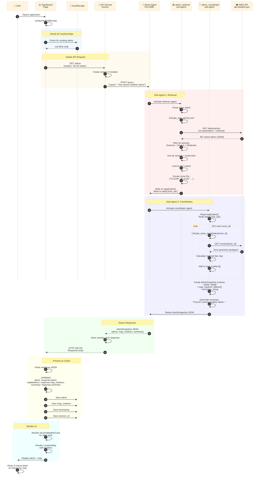

# 📊 Dashboard Alerts Loading Flow

**High-Resolution Data Flow Diagram**

---

## Overview

This flow shows how the Dashboard page loads and displays active severe weather alerts when a user first visits the application.

**Key Features:**
- Automatic loading on page load
- Top 5 most critical alerts nationwide
- Zone coordinate enrichment for map markers
- localStorage caching for performance
- 30-minute session persistence

---

## Sequence Diagram



---

## Detailed Step Breakdown

### Phase 1: Initial Load (Steps 1-3)

**What Happens:**
- User navigates to dashboard
- React component mounts
- Checks localStorage for cached data

**Code Location:** `frontend/src/pages/Dashboard.jsx`

```javascript
useEffect(() => {
  const cachedAlerts = localStorage.getItem('dashboardAlerts');
  if (!cachedAlerts) {
    loadAlerts(); // Trigger API call
  }
}, []);
```

---

### Phase 2: API Request (Steps 4-6)

**What Happens:**
- Dashboard calls API service
- API creates or reuses session
- Forwards request to Alerts Agent

**Code Location:** `frontend/src/services/api.js`

```javascript
async getAlerts(location) {
  const response = await axios.get(`${this.baseURL}/alerts`, {
    params: { location },
    timeout: 90000
  });
  return response.data;
}
```

**Agent Endpoint:** `POST http://localhost:8081/query`

---

### Phase 3: Alerts Retrieval (Steps 7-13)

**What Happens:**
- `alerts_retriever_agent` activates
- Calls `get_nws_alerts()` tool with no parameters (national query)
- NWS returns 357 active alerts
- Filters by severity (Extreme, Severe, Moderate)
- Sorts by severity then onset time
- Limits to top 5 most critical
- Extracts zone IDs for coordinate lookup

**Tool Implementation:** `agents/shared_tools/tools.py`

```python
def get_nws_alerts(state: str = None, latitude: float = None, longitude: float = None):
    if not state and not latitude and not longitude:
        # National query
        url = f"{NWS_API_BASE}/alerts/active"
        alerts = response.json()['features']
        
        # Limit to top 5 for national queries
        if len(alerts) > 10:
            alerts = alerts[:5]
    
    return alerts
```

**Performance Optimization:**
- National queries limited to 5 alerts (prevents timeout)
- Regional queries limited to 10 alerts
- Severity-based sorting ensures most critical shown first

---

### Phase 4: Coordinate Enrichment (Steps 14-20)

**What Happens:**
- `alerts_coordinator_agent` activates
- Reads alerts and zone IDs from state
- For each zone ID, calls `get_zone_coordinates()`
- Queries NWS for zone geometry
- Calculates centroid for map marker
- Builds map_markers array

**Tool Implementation:** `agents/shared_tools/tools.py`

```python
def get_zone_coordinates(zone_id: str):
    url = f"{NWS_API_BASE}/zones/forecast/{zone_id}"
    response = requests.get(url)
    geometry = response.json()['geometry']
    
    # Calculate centroid from polygon
    coords = geometry['coordinates'][0]
    lat = sum(c[1] for c in coords) / len(coords)
    lng = sum(c[0] for c in coords) / len(coords)
    
    return {"lat": lat, "lng": lng}
```

**Output Schema:** `AlertsSnapshot`

```python
class AlertsSnapshot(BaseModel):
    alerts: List[Alert]
    map_markers: List[MapMarker]
    summary: str
```

---

### Phase 5: Response Return (Steps 21-23)

**What Happens:**
- Coordinator returns AlertsSnapshot JSON
- Agent sends response to API service
- API includes session_id for future requests

**Response Format:**

```json
{
  "alerts": [
    {
      "id": "...",
      "event": "Hurricane Warning",
      "severity": "Extreme",
      "headline": "Hurricane Milton approaching...",
      "description": "...",
      "instruction": "...",
      "affected_zones": ["FLZ139", "FLZ142"],
      "onset": "2024-10-09T12:00:00Z",
      "expires": "2024-10-10T12:00:00Z"
    }
  ],
  "map_markers": [
    {
      "lat": 27.9506,
      "lng": -82.4572,
      "title": "Hurricane Warning",
      "severity": "Extreme"
    }
  ],
  "summary": "Found 5 severe weather alerts affecting multiple states..."
}
```

---

### Phase 6: Caching (Steps 24-28)

**What Happens:**
- Dashboard receives response
- Updates React state
- Saves to localStorage for 30-minute persistence
- Stores session_id for future requests

**localStorage Keys:**
- `dashboardAlerts` - Alert data
- `dashboardMapMarkers` - Map markers
- `dashboardTimestamp` - Cache timestamp
- `sessionId` - Backend session ID

**Session Management:**
- 30-minute expiration
- Automatic cleanup on expiration
- Manual "Clear All" button in header

---

### Phase 7: UI Rendering (Steps 29-31)

**What Happens:**
- React renders SevereWeatherCard components
- Renders LocationMap with markers
- User sees interactive dashboard

**Component Structure:**

```jsx
<Dashboard>
  <SevereWeatherCard 
    event="Hurricane Warning"
    severity="Extreme"
    headline="..."
  />
  <LocationMap 
    markers={mapMarkers}
    center={[27.95, -82.45]}
  />
</Dashboard>
```

---

## Performance Metrics

| Metric | Value | Notes |
|--------|-------|-------|
| **Total Time** | 2-4 seconds | First load (no cache) |
| **Cached Load** | <100ms | Subsequent loads |
| **NWS API Calls** | 6-10 | 1 alerts + 5 zones |
| **Data Transfer** | ~50KB | Compressed JSON |
| **Session Duration** | 30 minutes | Auto-cleanup after |

---

## Error Handling

### Timeout Protection

```javascript
// Frontend timeout: 90 seconds
const response = await axios.get('/alerts', { timeout: 90000 });

// Dashboard timeout: 75 seconds with fallback
const timeoutId = setTimeout(() => {
  setError('Loading alerts is taking longer than expected...');
}, 75000);
```

### Fallback Strategy

1. Try national query first
2. If timeout, try major states (FL, TX, CA, LA, NC)
3. If still fails, show cached data
4. If no cache, show error message with retry button

---

## Key Optimizations

✅ **Alert Limiting** - Top 5 most critical (prevents timeout)  
✅ **localStorage Caching** - 30-minute persistence  
✅ **Session Reuse** - Avoid creating new sessions  
✅ **Severity Sorting** - Most critical alerts first  
✅ **Parallel Zone Queries** - Faster coordinate enrichment  
✅ **Timeout Protection** - Graceful degradation  

---

## Related Files

- `frontend/src/pages/Dashboard.jsx` - Dashboard component
- `frontend/src/services/api.js` - API client
- `agents/alerts_snapshot_agent/agent.py` - Agent implementation
- `agents/shared_tools/tools.py` - Tool implementations

---

**Last Updated:** October 2025  
**Flow Version:** 1.0
