# 🏥 Emergency Resources Flow

**High-Resolution Data Flow Diagram**

---

## Overview

This flow shows how users search for emergency resources (shelters, hospitals, pharmacies) near a specific location and receive detailed facility information with routes.

**Key Features:**
- Location-based resource search (shelters, hospitals, pharmacies)
- Configurable search radius (5-50 miles)
- Google Places API integration
- Interactive map with facility markers
- Capacity and amenity information
- Contact details and addresses

---

## 🤖 Agent Flow - How It Works

**Simple View: Single Agent, Resource Discovery**

```mermaid
%%{init: {'theme':'base', 'themeVariables': { 'fontSize':'20px', 'fontFamily':'arial'}}}%%
graph LR
    subgraph Input["📥 INPUT"]
        UserRequest["User Request:<br/>'Find shelters in Tampa, FL<br/>within 10 miles'"]
    end
    
    subgraph EmergencyAgent["🏥 EMERGENCY RESOURCES AGENT"]
        direction TB
        
        subgraph Step1["STEP 1: Geocoding"]
            Geocode["<br/>🎯 Goal: Convert location to coordinates<br/><br/>Tool: geocode_address<br/><br/>Action:<br/>• Call Google Maps API<br/>• 'Tampa, FL' → lat/lng<br/><br/>Output: 27.95, -82.45<br/><br/>"]
        end
        
        subgraph Step2["STEP 2: Search Resources"]
            Search["<br/>🎯 Goal: Find nearby facilities<br/><br/>Tool: search_nearby_places<br/><br/>Actions:<br/>• Query Google Places API<br/>• Type: shelters/hospitals/pharmacies<br/>• Radius: 10 miles (16 km)<br/>• Get top results<br/><br/>Output: List of facilities<br/><br/>"]
        end
        
        subgraph Step3["STEP 3: Generate Map"]
            MapGen["<br/>🎯 Goal: Create interactive map<br/><br/>Tool: generate_map<br/><br/>Actions:<br/>• Create markers for each facility<br/>• Add facility details<br/>• Set map center<br/>• Generate map URL<br/><br/>Output: EmergencyResources<br/><br/>"]
        end
        
        Step1 --> Step2
        Step2 --> Step3
    end
    
    subgraph Output["📤 OUTPUT"]
        Response["EmergencyResources:<br/>• Shelters list<br/>• Hospitals list<br/>• Map with markers<br/>• Contact info<br/>• Directions"]
    end
    
    UserRequest --> Step1
    Step3 --> Response
    
    style Input fill:#e3f2fd,stroke:#1976d2,stroke-width:3px
    style EmergencyAgent fill:#e8f5e9,stroke:#388e3c,stroke-width:4px
    style Step1 fill:#e1f5fe,stroke:#0277bd,stroke-width:2px
    style Step2 fill:#fff3e0,stroke:#f57c00,stroke-width:2px
    style Step3 fill:#f3e5f5,stroke:#7b1fa2,stroke-width:2px
    style Output fill:#fff9c4,stroke:#f57f17,stroke-width:3px
```



**Key Insight:** The agent uses a **three-step process** - geocode location, search nearby facilities, then generate an interactive map with all resources.

---

## 🔄 Complete Sequence Diagram

**Detailed View: Full System Interaction**


---

## Detailed Step Breakdown

### Phase 1: User Input (Steps 1-4)

**What Happens:**
- User enters location
- Selects resource type (shelters/hospitals/pharmacies)
- Sets search radius (5-50 miles)
- Clicks search button

**Code Location:** `frontend/src/pages/EmergencyResources.jsx`

```javascript
const handleSearch = async () => {
  setLoading(true);
  const response = await api.getEmergencyResources(
    location,
    resourceType,
    radius
  );
  // ... process response
};
```

---

### Phase 2: Geocoding (Steps 9-14)

**What Happens:**
- Agent receives location string
- Calls `geocode_address()` tool
- Google Maps converts location to coordinates
- Returns lat/lng for search center

**Tool Implementation:** `agents/shared_tools/tools.py`

```python
def geocode_address(address: str):
    """Convert address to coordinates"""
    url = "https://maps.googleapis.com/maps/api/geocode/json"
    params = {
        "address": address,
        "key": GOOGLE_MAPS_API_KEY
    }
    
    response = requests.get(url, params=params)
    result = response.json()['results'][0]
    
    return {
        "lat": result['geometry']['location']['lat'],
        "lng": result['geometry']['location']['lng'],
        "formatted_address": result['formatted_address']
    }
```

---

### Phase 3: Resource Search (Steps 15-22)

**What Happens:**
- Agent calls `search_nearby_places()` tool
- Converts miles to meters (1 mile = 1609.34 meters)
- Queries Google Places API
- Returns up to 20 facilities

**Tool Implementation:**

```python
def search_nearby_places(
    latitude: float,
    longitude: float,
    place_type: str,
    radius_miles: int = 10
):
    """Search for nearby places using Google Places API"""
    radius_meters = int(radius_miles * 1609.34)
    
    url = "https://maps.googleapis.com/maps/api/place/nearbysearch/json"
    params = {
        "location": f"{latitude},{longitude}",
        "radius": radius_meters,
        "type": place_type,  # shelter, hospital, pharmacy
        "key": GOOGLE_MAPS_API_KEY
    }
    
    response = requests.get(url, params=params)
    results = response.json()['results']
    
    facilities = []
    for place in results[:20]:  # Limit to 20
        facilities.append({
            "name": place['name'],
            "address": place.get('vicinity', ''),
            "lat": place['geometry']['location']['lat'],
            "lng": place['geometry']['location']['lng'],
            "rating": place.get('rating'),
            "phone": place.get('formatted_phone_number'),
            "open_now": place.get('opening_hours', {}).get('open_now')
        })
    
    return facilities
```

**Place Types:**
- `shelter` - Emergency shelters
- `hospital` - Hospitals and medical centers
- `pharmacy` - Pharmacies and drugstores

---

### Phase 4: Map Generation (Steps 23-27)

**What Happens:**
- Agent calls `generate_map()` tool
- Creates markers for each facility
- Sets map center to search location
- Generates map structure

**Output Schema:** `EmergencyResources`

```python
class EmergencyResources(BaseModel):
    shelters: List[Facility]
    hospitals: List[Facility]
    pharmacies: List[Facility]
    map_markers: List[MapMarker]
    map_center: Dict[str, float]
    summary: str

class Facility(BaseModel):
    name: str
    address: str
    lat: float
    lng: float
    phone: Optional[str]
    rating: Optional[float]
    open_now: Optional[bool]
    distance_miles: Optional[float]
```

**Example Response:**

```json
{
  "shelters": [
    {
      "name": "Red Cross Emergency Shelter",
      "address": "123 Main St, Tampa, FL",
      "lat": 27.9506,
      "lng": -82.4572,
      "phone": "(813) 555-0100",
      "rating": 4.5,
      "open_now": true,
      "distance_miles": 2.3
    }
  ],
  "map_markers": [
    {
      "lat": 27.9506,
      "lng": -82.4572,
      "title": "Red Cross Emergency Shelter",
      "address": "123 Main St, Tampa, FL"
    }
  ],
  "map_center": {
    "lat": 27.9506,
    "lng": -82.4572
  },
  "summary": "Found 5 emergency shelters within 10 miles of Tampa, FL"
}
```

---

## Performance Metrics

| Metric | Value | Notes |
|--------|-------|-------|
| **Total Time** | 1-3 seconds | First search (no cache) |
| **Cached Load** | <50ms | Subsequent searches |
| **API Calls** | 2 total | 1 geocode + 1 places |
| **Max Results** | 20 facilities | Per resource type |
| **Search Radius** | 5-50 miles | User configurable |
| **Cache Duration** | 30 minutes | Resource data freshness |

---

## Error Handling

### Invalid Location

```javascript
try {
  const response = await api.getEmergencyResources(location, type, radius);
} catch (error) {
  if (error.response?.status === 404) {
    setError('Location not found. Please try a different location.');
  }
}
```

### No Results Found

```javascript
if (response.shelters.length === 0) {
  setMessage('No shelters found within 10 miles. Try increasing the radius.');
}
```

### Google API Errors

- **Quota exceeded**: Show cached results if available
- **Invalid API key**: Display error message
- **Network timeout**: Retry with exponential backoff

---

## Key Features

✅ **Multi-Type Search** - Shelters, hospitals, pharmacies  
✅ **Configurable Radius** - 5 to 50 miles  
✅ **Real-Time Data** - Google Places API  
✅ **Contact Information** - Phone numbers, addresses  
✅ **Ratings & Reviews** - User ratings from Google  
✅ **Open Hours** - Current open/closed status  
✅ **Interactive Map** - All facilities marked  
✅ **Distance Calculation** - Miles from search center  

---

## Related Files

- `frontend/src/pages/EmergencyResources.jsx` - UI component
- `frontend/src/services/api.js` - API client
- `agents/emergency_resources_agent/agent.py` - Agent implementation
- `agents/shared_tools/tools.py` - Tool implementations

---

**Last Updated:** October 2025  
**Flow Version:** 1.0
