# 🌤️ Forecast Lookup Flow

**High-Resolution Data Flow Diagram**

---

## Overview

This flow shows how users search for weather forecasts by location and receive detailed 7-day and hourly predictions.

**Key Features:**
- Location name to coordinates conversion (geocoding)
- 7-day forecast with day/night periods
- 48-hour hourly predictions
- Weather icons and detailed descriptions
- Temperature, precipitation, wind data

---

## Sequence Diagram

```mermaid
%%{init: {'theme':'base', 'themeVariables': { 'fontSize':'18px', 'fontFamily':'arial'}, 'sequence': {'mirrorActors': false, 'messageAlign': 'center'}}}%%
sequenceDiagram
    autonumber
    participant User as 👤 User
    participant ForecastPage as 🌤️ Forecast<br/>Page
    participant LocalStorage as 💾 localStorage
    participant API as 🔌 API Service<br/>(Axios)
    participant ForecastAgent as 🌤️ Forecast Agent<br/>Port 8082
    participant GoogleMaps as 🗺️ Google Maps<br/>Geocoding API
    participant NWS as 🌦️ NWS API<br/>api.weather.gov
    
    User->>ForecastPage: Types "Tampa, FL"
    ForecastPage->>ForecastPage: Update input state
    User->>ForecastPage: Clicks "Get Forecast"
    
    rect rgb(240, 248, 255)
        Note over ForecastPage,LocalStorage: Check Cache
        ForecastPage->>LocalStorage: Check for cached forecast<br/>key: "Tampa, FL"
        LocalStorage-->>ForecastPage: null (not cached)
    end
    
    rect rgb(255, 250, 240)
        Note over ForecastPage,API: Initiate Request
        ForecastPage->>ForecastPage: setLoading(true)
        ForecastPage->>API: GET /forecast<br/>?location=Tampa, FL
        API->>API: Attach session_id
        API->>ForecastAgent: POST /query<br/>{"query": "Get forecast for Tampa, FL"}
    end
    
    rect rgb(255, 240, 240)
        Note over ForecastAgent,GoogleMaps: Step 1: Geocoding
        ForecastAgent->>ForecastAgent: Parse location: "Tampa, FL"
        ForecastAgent->>ForecastAgent: Call geocode_address() tool
        ForecastAgent->>GoogleMaps: GET /geocode/json<br/>?address=Tampa, FL
        GoogleMaps-->>ForecastAgent: {<br/>  lat: 27.9506,<br/>  lng: -82.4572,<br/>  formatted_address: "Tampa, FL, USA"<br/>}
        ForecastAgent->>ForecastAgent: Store coordinates
    end
    
    rect rgb(240, 255, 240)
        Note over ForecastAgent,NWS: Step 2: Get Grid Point
        ForecastAgent->>ForecastAgent: Call get_nws_forecast() tool
        ForecastAgent->>NWS: GET /points/27.9506,-82.4572
        NWS-->>ForecastAgent: {<br/>  gridId: "TBW",<br/>  gridX: 64,<br/>  gridY: 68,<br/>  forecast: "/gridpoints/TBW/64,68/forecast",<br/>  forecastHourly: "/gridpoints/TBW/64,68/forecast/hourly"<br/>}
        ForecastAgent->>ForecastAgent: Extract grid coordinates
    end
    
    rect rgb(240, 240, 255)
        Note over ForecastAgent,NWS: Step 3: Get Daily Forecast
        ForecastAgent->>NWS: GET /gridpoints/TBW/64,68/forecast
        NWS-->>ForecastAgent: {<br/>  periods: [<br/>    {number: 1, name: "This Afternoon", ...},<br/>    {number: 2, name: "Tonight", ...},<br/>    {number: 3, name: "Thursday", ...},<br/>    ... (14 periods total)<br/>  ]<br/>}
        ForecastAgent->>ForecastAgent: Parse 14 periods (7 days)
    end
    
    rect rgb(255, 245, 240)
        Note over ForecastAgent,NWS: Step 4: Get Hourly Forecast
        ForecastAgent->>NWS: GET /gridpoints/TBW/64,68/forecast/hourly
        NWS-->>ForecastAgent: {<br/>  periods: [<br/>    {startTime: "2024-10-09T14:00:00", temp: 85, ...},<br/>    {startTime: "2024-10-09T15:00:00", temp: 86, ...},<br/>    ... (156 periods total)<br/>  ]<br/>}
        ForecastAgent->>ForecastAgent: Parse hourly data<br/>Limit to next 48 hours
    end
    
    rect rgb(240, 255, 255)
        Note over ForecastAgent: Step 5: Format Response
        ForecastAgent->>ForecastAgent: Group day/night periods:<br/>• Pair consecutive periods<br/>• Extract key data<br/>• Format temperatures<br/>• Add weather icons
        
        ForecastAgent->>ForecastAgent: Create ForecastData schema:<br/>• location: LocationInfo<br/>• daily_forecast: DailyForecast[]<br/>• hourly_forecast: HourlyForecast[]<br/>• summary: string
        
        ForecastAgent->>ForecastAgent: Generate summary:<br/>"7-day forecast for Tampa, FL..."
    end
    
    rect rgb(255, 255, 240)
        Note over ForecastAgent,API: Return Response
        ForecastAgent-->>API: ForecastData JSON
        API-->>ForecastPage: HTTP 200 OK<br/>Response body
    end
    
    rect rgb(240, 248, 255)
        Note over ForecastPage,LocalStorage: Cache & Display
        ForecastPage->>ForecastPage: setLoading(false)
        ForecastPage->>ForecastPage: setState({<br/>  forecastData: response,<br/>  location: "Tampa, FL"<br/>})
        
        ForecastPage->>LocalStorage: Save forecast data
        ForecastPage->>LocalStorage: Save location
        ForecastPage->>LocalStorage: Save timestamp
    end
    
    rect rgb(255, 250, 255)
        Note over ForecastPage,User: Render UI
        ForecastPage->>ForecastPage: Render 7-day forecast cards
        ForecastPage->>ForecastPage: Render hourly forecast table
        ForecastPage->>ForecastPage: Render location info
        ForecastPage->>User: Display complete forecast
    end
    
    User->>User: Views 7-day + hourly forecast<br/>for Tampa, FL
```



---

## Detailed Step Breakdown

### Phase 1: User Input (Steps 1-3)

**What Happens:**
- User types location in search box
- Clicks "Get Forecast" button
- Component checks cache first

**Code Location:** `frontend/src/pages/Forecast.jsx`

```javascript
const handleSearch = async () => {
  const cached = localStorage.getItem(`forecast_${location}`);
  if (cached && !isExpired(cached)) {
    setForecastData(JSON.parse(cached));
    return;
  }
  
  setLoading(true);
  const response = await api.getForecast(location);
  // ... process response
};
```

---

### Phase 2: Geocoding (Steps 7-11)

**What Happens:**
- Agent receives location string
- Calls `geocode_address()` tool
- Google Maps converts "Tampa, FL" to coordinates
- Returns lat/lng and formatted address

**Tool Implementation:** `agents/shared_tools/tools.py`

```python
def geocode_address(address: str):
    """Convert address to coordinates using Google Maps Geocoding API"""
    url = "https://maps.googleapis.com/maps/api/geocode/json"
    params = {
        "address": address,
        "key": GOOGLE_MAPS_API_KEY
    }
    
    response = requests.get(url, params=params)
    result = response.json()['results'][0]
    
    return {
        "lat": result['geometry']['location']['lat'],
        "lng": result['geometry']['location']['lng'],
        "formatted_address": result['formatted_address']
    }
```

**Example Output:**
```json
{
  "lat": 27.9506,
  "lng": -82.4572,
  "formatted_address": "Tampa, FL, USA"
}
```

---

### Phase 3: Grid Point Lookup (Steps 12-16)

**What Happens:**
- Agent calls NWS /points endpoint with coordinates
- NWS returns grid information for the location
- Grid ID, X, Y coordinates identify the forecast zone
- URLs for daily and hourly forecasts provided

**NWS API Call:**
```
GET https://api.weather.gov/points/27.9506,-82.4572
```

**Response:**
```json
{
  "properties": {
    "gridId": "TBW",
    "gridX": 64,
    "gridY": 68,
    "forecast": "https://api.weather.gov/gridpoints/TBW/64,68/forecast",
    "forecastHourly": "https://api.weather.gov/gridpoints/TBW/64,68/forecast/hourly",
    "forecastOffice": "https://api.weather.gov/offices/TBW"
  }
}
```

**Grid System:**
- **gridId**: Weather Forecast Office (WFO) identifier (TBW = Tampa Bay)
- **gridX, gridY**: Coordinates within the WFO's forecast grid
- Each WFO covers a specific geographic region

---

### Phase 4: Daily Forecast (Steps 17-20)

**What Happens:**
- Agent calls forecast endpoint with grid coordinates
- NWS returns 14 periods (7 days × day/night)
- Each period includes temperature, weather, wind, etc.

**NWS API Call:**
```
GET https://api.weather.gov/gridpoints/TBW/64,68/forecast
```

**Response Structure:**
```json
{
  "properties": {
    "periods": [
      {
        "number": 1,
        "name": "This Afternoon",
        "startTime": "2024-10-09T14:00:00-04:00",
        "endTime": "2024-10-09T18:00:00-04:00",
        "isDaytime": true,
        "temperature": 85,
        "temperatureUnit": "F",
        "windSpeed": "10 mph",
        "windDirection": "SW",
        "icon": "https://api.weather.gov/icons/land/day/sct?size=medium",
        "shortForecast": "Partly Sunny",
        "detailedForecast": "Partly sunny, with a high near 85..."
      },
      {
        "number": 2,
        "name": "Tonight",
        "isDaytime": false,
        "temperature": 72,
        // ...
      }
      // ... 12 more periods
    ]
  }
}
```

**Period Grouping:**
- Periods 1-2: Today (afternoon + tonight)
- Periods 3-4: Day 2 (day + night)
- Periods 5-6: Day 3 (day + night)
- ... and so on for 7 days total

---

### Phase 5: Hourly Forecast (Steps 21-24)

**What Happens:**
- Agent calls hourly forecast endpoint
- NWS returns 156 hourly periods (6.5 days)
- Agent limits to next 48 hours for UI display

**NWS API Call:**
```
GET https://api.weather.gov/gridpoints/TBW/64,68/forecast/hourly
```

**Response Structure:**
```json
{
  "properties": {
    "periods": [
      {
        "number": 1,
        "startTime": "2024-10-09T14:00:00-04:00",
        "endTime": "2024-10-09T15:00:00-04:00",
        "isDaytime": true,
        "temperature": 85,
        "temperatureUnit": "F",
        "windSpeed": "10 mph",
        "windDirection": "SW",
        "shortForecast": "Partly Sunny",
        "probabilityOfPrecipitation": {
          "value": 20
        }
      },
      // ... 155 more hourly periods
    ]
  }
}
```

**Filtering:**
```python
# Limit to next 48 hours
hourly_periods = periods[:48]
```

---

### Phase 6: Response Formatting (Steps 25-28)

**What Happens:**
- Agent groups day/night periods together
- Extracts key weather data
- Formats into ForecastData schema
- Generates human-readable summary

**Output Schema:** `ForecastData`

```python
class ForecastData(BaseModel):
    location: LocationInfo
    daily_forecast: List[DailyForecast]
    hourly_forecast: List[HourlyForecast]
    summary: str

class LocationInfo(BaseModel):
    name: str
    lat: float
    lng: float
    formatted_address: str

class DailyForecast(BaseModel):
    date: str
    day: PeriodForecast
    night: PeriodForecast

class PeriodForecast(BaseModel):
    temperature: int
    temperature_unit: str
    wind_speed: str
    wind_direction: str
    short_forecast: str
    detailed_forecast: str
    icon_url: str
    precipitation_probability: Optional[int]
```

**Example Response:**
```json
{
  "location": {
    "name": "Tampa, FL",
    "lat": 27.9506,
    "lng": -82.4572,
    "formatted_address": "Tampa, FL, USA"
  },
  "daily_forecast": [
    {
      "date": "2024-10-09",
      "day": {
        "temperature": 85,
        "temperature_unit": "F",
        "wind_speed": "10 mph",
        "wind_direction": "SW",
        "short_forecast": "Partly Sunny",
        "detailed_forecast": "Partly sunny, with a high near 85...",
        "icon_url": "https://api.weather.gov/icons/land/day/sct",
        "precipitation_probability": 20
      },
      "night": {
        "temperature": 72,
        // ...
      }
    }
    // ... 6 more days
  ],
  "hourly_forecast": [
    {
      "time": "2024-10-09T14:00:00",
      "temperature": 85,
      "short_forecast": "Partly Sunny",
      "precipitation_probability": 20
    }
    // ... 47 more hours
  ],
  "summary": "7-day forecast for Tampa, FL shows partly sunny conditions..."
}
```

---

### Phase 7: Caching & Display (Steps 29-35)

**What Happens:**
- Frontend receives ForecastData
- Updates React state
- Saves to localStorage (30-minute cache)
- Renders forecast cards and hourly table

**localStorage Keys:**
- `forecast_Tampa, FL` - Forecast data
- `forecastLocation` - Current location
- `forecastTimestamp` - Cache timestamp

**UI Components:**

```jsx
<ForecastPage>
  {/* 7-Day Forecast */}
  <div className="grid grid-cols-1 md:grid-cols-7 gap-4">
    {daily_forecast.map(day => (
      <DayForecastCard 
        date={day.date}
        dayTemp={day.day.temperature}
        nightTemp={day.night.temperature}
        icon={day.day.icon_url}
        forecast={day.day.short_forecast}
      />
    ))}
  </div>
  
  {/* Hourly Forecast */}
  <HourlyForecastTable 
    hours={hourly_forecast}
  />
</ForecastPage>
```

---

## API Endpoints Used

| Endpoint | Purpose | Example |
|----------|---------|---------|
| **Google Maps Geocoding** | Convert location to coordinates | `Tampa, FL` → `27.95, -82.45` |
| **NWS Points** | Get grid information | `/points/27.95,-82.45` → `TBW/64/68` |
| **NWS Forecast** | Get 7-day forecast | `/gridpoints/TBW/64,68/forecast` |
| **NWS Hourly** | Get hourly forecast | `/gridpoints/TBW/64,68/forecast/hourly` |

---

## Performance Metrics

| Metric | Value | Notes |
|--------|-------|-------|
| **Total Time** | 1-2 seconds | First load (no cache) |
| **Cached Load** | <50ms | Subsequent loads |
| **API Calls** | 4 total | 1 geocode + 3 NWS |
| **Data Transfer** | ~100KB | Compressed JSON |
| **Cache Duration** | 30 minutes | Weather data freshness |

---

## Error Handling

### Invalid Location

```javascript
try {
  const response = await api.getForecast(location);
} catch (error) {
  if (error.response?.status === 404) {
    setError('Location not found. Please try a different location.');
  }
}
```

### NWS API Errors

- **Grid not found**: Location outside US coverage
- **Forecast unavailable**: Temporary NWS outage
- **Rate limiting**: Too many requests

**Fallback Strategy:**
1. Show cached data if available
2. Display user-friendly error message
3. Provide retry button
4. Suggest alternative locations

---

## Key Features

✅ **Smart Geocoding** - Handles city names, zip codes, addresses  
✅ **Day/Night Grouping** - Paired periods for better UX  
✅ **48-Hour Hourly** - Detailed short-term predictions  
✅ **Weather Icons** - Visual forecast indicators  
✅ **Precipitation Probability** - Rain/snow chances  
✅ **Wind Information** - Speed and direction  
✅ **Caching** - 30-minute localStorage persistence  

---

## Related Files

- `frontend/src/pages/Forecast.jsx` - Forecast page component
- `frontend/src/services/api.js` - API client
- `agents/forecast_agent/agent.py` - Agent implementation
- `agents/shared_tools/tools.py` - Tool implementations

---

**Last Updated:** October 2025  
**Flow Version:** 1.0
