# 🌀 Hurricane Simulation Flow

**High-Resolution Data Flow Diagram**

---

## Overview

This flow shows how users upload hurricane satellite images and receive AI-powered evacuation priority analysis.

**Key Features:**
- Gemini Vision API for image analysis
- Hurricane category detection (1-5)
- Affected states identification
- Historical flood data correlation
- Risk-based evacuation priorities
- Top 20 high-risk locations mapped

---

## Sequence Diagram

```mermaid
%%{init: {'theme':'base', 'themeVariables': { 'fontSize':'18px', 'fontFamily':'arial'}, 'sequence': {'mirrorActors': false, 'messageAlign': 'center'}}}%%
sequenceDiagram
    autonumber
    participant User as 👤 User
    participant HurricanePage as 🌀 Hurricane<br/>Simulation Page
    participant API as 🔌 API Service<br/>(Axios)
    participant HurricaneAgent as 🌀 Hurricane Agent<br/>Port 8085
    participant ImageAnalysis as 🖼️ hurricane_image<br/>_analysis_agent
    participant GeminiVision as 🤖 Gemini Vision<br/>gemini-2.5-flash
    participant EvacCoordinator as 🎯 evacuation<br/>_coordinator_agent
    participant BigQuery as 📊 BigQuery<br/>Flood Risk Data
    
    User->>HurricanePage: Uploads hurricane image
    HurricanePage->>HurricanePage: Validate image<br/>(size, format)
    HurricanePage->>HurricanePage: Show preview
    User->>HurricanePage: Clicks "Analyze Hurricane"
    
    rect rgb(255, 250, 240)
        Note over HurricanePage,API: Prepare Upload
        HurricanePage->>HurricanePage: setLoading(true)
        HurricanePage->>HurricanePage: Create FormData<br/>append image file
        HurricanePage->>API: POST /analyze<br/>multipart/form-data
        API->>API: Attach session_id
        API->>HurricaneAgent: POST /query<br/>with image
    end
    
    rect rgb(255, 240, 240)
        Note over HurricaneAgent,ImageAnalysis: Sub-Agent 1: Image Analysis
        HurricaneAgent->>ImageAnalysis: Activate image analysis agent
        ImageAnalysis->>ImageAnalysis: Receive image data
        ImageAnalysis->>ImageAnalysis: Prepare vision prompt:<br/>"Analyze this hurricane satellite image..."
        
        ImageAnalysis->>GeminiVision: Send image + prompt<br/>model: gemini-2.5-flash
        GeminiVision->>GeminiVision: Vision API processing:<br/>• Identify hurricane features<br/>• Detect eye, spiral bands<br/>• Estimate intensity<br/>• Identify landmass
        
        GeminiVision-->>ImageAnalysis: Analysis result:<br/>{<br/>  category: 4,<br/>  affected_states: ["FL", "AL", "MS", "GA", "TN"],<br/>  bounding_box: {<br/>    north: 32.5, south: 24.5,<br/>    east: -80.0, west: -88.0<br/>  },<br/>  confidence: "high"<br/>}
        
        ImageAnalysis->>ImageAnalysis: Validate analysis:<br/>• Category 1-5<br/>• Valid state codes<br/>• Reasonable bounding box
        
        ImageAnalysis->>HurricaneAgent: Write to state['hurricane_data']:<br/>HurricaneData schema
    end
    
    rect rgb(240, 255, 240)
        Note over HurricaneAgent,EvacCoordinator: Sub-Agent 2: Evacuation Coordination
        HurricaneAgent->>EvacCoordinator: Activate evacuation coordinator
        EvacCoordinator->>EvacCoordinator: Read state['hurricane_data']<br/>Extract: category, affected_states
        
        EvacCoordinator->>EvacCoordinator: Initialize:<br/>• all_flood_events = []<br/>• all_locations = []<br/>• processed_coords = set()
        
        loop For each affected state
            EvacCoordinator->>EvacCoordinator: Call get_flood_risk_data(state)
            EvacCoordinator->>BigQuery: Query flood risk table:<br/>SELECT * FROM flood_events<br/>WHERE state = 'FL'<br/>ORDER BY severity DESC
            
            BigQuery-->>EvacCoordinator: Historical flood events:<br/>[<br/>  {lat: 27.95, lng: -82.45, severity: 9.2, ...},<br/>  {lat: 28.54, lng: -81.38, severity: 8.7, ...},<br/>  ...<br/>]
            
            EvacCoordinator->>EvacCoordinator: Append to all_flood_events
        end
        
        EvacCoordinator->>EvacCoordinator: Deduplicate coordinates:<br/>• Round to 2 decimals<br/>• Remove duplicates<br/>• Keep highest severity
        
        EvacCoordinator->>EvacCoordinator: Calculate risk scores:<br/>base_risk = hurricane_category * 2<br/>flood_risk = historical_severity<br/>total_risk = base_risk + flood_risk
        
        EvacCoordinator->>EvacCoordinator: Sort by risk score (descending)
        EvacCoordinator->>EvacCoordinator: Limit to top 20 locations
        
        EvacCoordinator->>EvacCoordinator: Create EvacuationPlan schema:<br/>• prioritized_locations<br/>• affected_states<br/>• hurricane_category<br/>• total_high_risk_locations<br/>• highest_risk_score<br/>• insights
        
        EvacCoordinator->>HurricaneAgent: Return EvacuationPlan
    end
    
    rect rgb(240, 240, 255)
        Note over HurricaneAgent,API: Return Response
        HurricaneAgent-->>API: EvacuationPlan JSON
        API-->>HurricanePage: HTTP 200 OK<br/>Response body
    end
    
    rect rgb(255, 255, 240)
        Note over HurricanePage,User: Display Results
        HurricanePage->>HurricanePage: setLoading(false)
        HurricanePage->>HurricanePage: setState({<br/>  evacuationPlan: response,<br/>  analyzed: true<br/>})
        
        HurricanePage->>HurricanePage: Render hurricane info card:<br/>• Category badge<br/>• Affected states<br/>• Risk summary
        
        HurricanePage->>HurricanePage: Render priority table:<br/>• Top 20 locations<br/>• Risk scores<br/>• Details
        
        HurricanePage->>HurricanePage: Render map:<br/>• Color-coded markers<br/>• Risk-based sizing<br/>• Tooltips
        
        HurricanePage->>HurricanePage: Render insights:<br/>• AI analysis<br/>• Recommendations<br/>• Statistics
        
        HurricanePage->>User: Display evacuation plan
    end
    
    User->>User: Views top 20 evacuation<br/>priorities on map
```



---

## Detailed Step Breakdown

### Phase 1: Image Upload (Steps 1-4)

**What Happens:**
- User selects hurricane satellite image
- Frontend validates file (size < 10MB, format: jpg/png)
- Shows image preview
- User clicks "Analyze Hurricane"

**Code Location:** `frontend/src/pages/HurricaneSimulation.jsx`

```javascript
const handleImageUpload = (event) => {
  const file = event.target.files[0];
  
  // Validate file
  if (file.size > 10 * 1024 * 1024) {
    setError('Image must be less than 10MB');
    return;
  }
  
  if (!['image/jpeg', 'image/png'].includes(file.type)) {
    setError('Only JPG and PNG images are supported');
    return;
  }
  
  setImageFile(file);
  setImagePreview(URL.createObjectURL(file));
};
```

---

### Phase 2: API Request (Steps 5-9)

**What Happens:**
- Frontend creates FormData with image
- Sends multipart/form-data POST request
- API forwards to Hurricane Agent

**Code Location:** `frontend/src/services/api.js`

```javascript
async analyzeHurricane(imageFile) {
  const formData = new FormData();
  formData.append('image', imageFile);
  
  const response = await axios.post(
    `${this.baseURL}/analyze`,
    formData,
    {
      headers: { 'Content-Type': 'multipart/form-data' },
      timeout: 120000 // 2 minutes for image processing
    }
  );
  
  return response.data;
}
```

---

### Phase 3: Image Analysis (Steps 10-20)

**What Happens:**
- `hurricane_image_analysis_agent` receives image
- Prepares vision prompt for Gemini
- Sends to Gemini Vision API
- Extracts hurricane metadata

**Agent Implementation:** `agents/hurricane_simulation_agent/agent.py`

```python
hurricane_image_analysis_agent = LlmAgent(
    model="gemini-2.5-flash",
    name="hurricane_image_analysis_agent",
    instructions="""
    You are a hurricane image analysis specialist.
    
    Analyze the uploaded hurricane satellite image and extract:
    1. Hurricane category (1-5 based on Saffir-Simpson scale)
    2. Affected US states (2-letter codes)
    3. Geographic bounding box (north, south, east, west coordinates)
    
    Look for visual indicators:
    - Eye clarity and size (stronger hurricanes have clearer eyes)
    - Spiral band organization
    - Cloud top temperatures
    - Storm size and symmetry
    
    Return HurricaneData schema with your analysis.
    """,
    output_key="hurricane_data"
)
```

**Vision Prompt:**
```
Analyze this hurricane satellite image and provide:

1. **Hurricane Category** (1-5):
   - Category 1: 74-95 mph winds
   - Category 2: 96-110 mph winds
   - Category 3: 111-129 mph winds (Major)
   - Category 4: 130-156 mph winds (Major)
   - Category 5: 157+ mph winds (Major)

2. **Affected US States**: List 2-letter state codes

3. **Geographic Bounding Box**: North, South, East, West coordinates

4. **Confidence Level**: High, Medium, or Low
```

**Example Vision Response:**
```json
{
  "category": 4,
  "affected_states": ["FL", "AL", "MS", "GA", "TN"],
  "bounding_box": {
    "north": 32.5,
    "south": 24.5,
    "east": -80.0,
    "west": -88.0
  },
  "confidence": "high",
  "visual_indicators": {
    "eye_clarity": "very clear",
    "spiral_bands": "well-organized",
    "storm_size": "large"
  }
}
```

**Output Schema:** `HurricaneData`

```python
class HurricaneData(BaseModel):
    category: int  # 1-5
    affected_states: List[str]  # ["FL", "AL", ...]
    bounding_box: Dict[str, float]  # {north, south, east, west}
    confidence: str  # "high", "medium", "low"
```

---

### Phase 4: Evacuation Coordination (Steps 21-35)

**What Happens:**
- `evacuation_coordinator_agent` reads hurricane data
- Queries flood risk data for each affected state
- Calculates risk scores
- Prioritizes top 20 locations

**Agent Implementation:**

```python
evacuation_coordinator_agent = LlmAgent(
    model="gemini-2.5-flash",
    name="evacuation_coordinator_agent",
    instructions="""
    You are an evacuation planning specialist.
    
    Using the hurricane data from image analysis:
    1. Query flood risk data for each affected state
    2. Calculate evacuation priority scores
    3. Identify top 20 high-risk locations
    4. Generate evacuation recommendations
    
    Risk Scoring Formula:
    - Base risk = hurricane_category * 2
    - Flood risk = historical_flood_severity (0-10)
    - Total risk = base_risk + flood_risk
    
    Prioritize locations with:
    - High historical flood risk
    - Proximity to coast
    - Dense population
    - Critical infrastructure
    """,
    output_key="evacuation_plan"
)
```

**Flood Data Query:**

```python
def get_flood_risk_data(state: str):
    """Query BigQuery for historical flood events"""
    query = f"""
    SELECT 
        latitude,
        longitude,
        severity_score,
        event_name,
        date,
        affected_population
    FROM `weather_data.flood_events`
    WHERE state = '{state}'
    ORDER BY severity_score DESC
    LIMIT 50
    """
    
    results = bigquery_client.query(query).result()
    return [dict(row) for row in results]
```

**Risk Calculation:**

```python
# Example for Category 4 hurricane
base_risk = 4 * 2 = 8

# Location with high flood history
flood_risk = 9.2  # Historical severity

# Total risk score
total_risk = 8 + 9.2 = 17.2
```

**Deduplication:**
```python
# Round coordinates to 2 decimals to identify duplicates
coord_key = f"{round(lat, 2)},{round(lng, 2)}"

if coord_key not in processed_coords:
    processed_coords.add(coord_key)
    all_locations.append(location)
else:
    # Keep location with higher risk score
    if location.risk_score > existing.risk_score:
        all_locations[index] = location
```

**Output Schema:** `EvacuationPlan`

```python
class EvacuationPlan(BaseModel):
    prioritized_locations: List[EvacuationPriority]
    affected_states: List[str]
    hurricane_category: int
    total_high_risk_locations: int
    highest_risk_score: float
    insights: Dict[str, Any]

class EvacuationPriority(BaseModel):
    lat: float
    lng: float
    risk_score: float
    details: str
    historical_events: List[str]
    population_estimate: Optional[int]
```

---

### Phase 5: Response Formatting (Steps 36-38)

**Example Response:**

```json
{
  "prioritized_locations": [
    {
      "lat": 27.95,
      "lng": -82.45,
      "risk_score": 17.2,
      "details": "Tampa Bay area - High flood risk from Hurricane Harvey (2017)",
      "historical_events": ["Hurricane Harvey 2017", "Hurricane Irma 2017"],
      "population_estimate": 400000
    },
    {
      "lat": 28.54,
      "lng": -81.38,
      "risk_score": 16.8,
      "details": "Orlando metro - Inland flooding risk",
      "historical_events": ["Hurricane Ian 2022"],
      "population_estimate": 300000
    }
    // ... 18 more locations
  ],
  "affected_states": ["FL", "AL", "MS", "GA", "TN"],
  "hurricane_category": 4,
  "total_high_risk_locations": 20,
  "highest_risk_score": 17.2,
  "insights": {
    "summary": "Category 4 hurricane affecting 5 states with 20 high-risk evacuation zones identified",
    "recommendations": [
      "Immediate evacuation recommended for Tampa Bay area (risk score 17.2)",
      "Prepare for inland flooding in Orlando metro area",
      "Monitor storm surge forecasts for coastal Alabama and Mississippi"
    ],
    "statistics": {
      "avg_risk_score": 14.5,
      "coastal_locations": 12,
      "inland_locations": 8,
      "total_affected_population": 5000000
    }
  }
}
```

---

### Phase 6: UI Display (Steps 39-46)

**What Happens:**
- Frontend receives EvacuationPlan
- Renders hurricane info card
- Displays priority table
- Shows interactive map with markers
- Presents AI insights

**UI Components:**

```jsx
<HurricaneSimulation>
  {/* Hurricane Info Card */}
  <div className="bg-red-50 border border-red-200 rounded-lg p-6">
    <h2>Category {evacuationPlan.hurricane_category} Hurricane</h2>
    <p>Affected States: {evacuationPlan.affected_states.join(', ')}</p>
    <p>High-Risk Locations: {evacuationPlan.total_high_risk_locations}</p>
  </div>
  
  {/* Priority Table */}
  <table>
    {evacuationPlan.prioritized_locations.map((loc, index) => (
      <tr key={index}>
        <td>#{index + 1}</td>
        <td>{loc.details}</td>
        <td className="font-bold">{loc.risk_score.toFixed(1)}</td>
      </tr>
    ))}
  </table>
  
  {/* Interactive Map */}
  <LocationMap 
    markers={evacuationPlan.prioritized_locations.map(loc => ({
      lat: loc.lat,
      lng: loc.lng,
      title: `Risk: ${loc.risk_score.toFixed(1)}`,
      color: getRiskColor(loc.risk_score)
    }))}
    center={[27.95, -82.45]}
  />
  
  {/* AI Insights */}
  <div className="bg-blue-50 p-6 rounded-lg">
    <h3>AI Analysis</h3>
    <p>{evacuationPlan.insights.summary}</p>
    <ul>
      {evacuationPlan.insights.recommendations.map(rec => (
        <li>{rec}</li>
      ))}
    </ul>
  </div>
</HurricaneSimulation>
```

**Risk Color Coding:**
```javascript
const getRiskColor = (score) => {
  if (score >= 15) return 'red';      // Critical
  if (score >= 12) return 'orange';   // High
  if (score >= 9) return 'yellow';    // Moderate
  return 'blue';                       // Low
};
```

---

## Performance Metrics

| Metric | Value | Notes |
|--------|-------|-------|
| **Total Time** | 10-15 seconds | Image analysis + data query |
| **Vision API** | 3-5 seconds | Gemini image processing |
| **BigQuery Queries** | 5-8 seconds | 5 states × ~1.5s each |
| **Risk Calculation** | 1-2 seconds | Sorting + deduplication |
| **Image Size Limit** | 10MB | Frontend validation |
| **Timeout** | 120 seconds | Extended for image processing |

---

## Error Handling

### Invalid Image

```javascript
if (!file.type.startsWith('image/')) {
  setError('Please upload a valid image file');
  return;
}
```

### Vision API Errors

- **Low confidence**: Show warning, allow user to retry
- **No hurricane detected**: Suggest uploading different image
- **API timeout**: Retry with exponential backoff

### Data Query Errors

- **No flood data**: Use hurricane category only for risk scoring
- **BigQuery timeout**: Fall back to cached historical data
- **Invalid state codes**: Filter out and continue with valid states

---

## Key Features

✅ **Gemini Vision** - AI-powered image analysis  
✅ **Category Detection** - Saffir-Simpson scale (1-5)  
✅ **Multi-State Analysis** - Query flood data for all affected states  
✅ **Risk Scoring** - Hurricane intensity + historical flood data  
✅ **Top 20 Priorities** - Most critical evacuation zones  
✅ **Interactive Map** - Color-coded risk markers  
✅ **AI Insights** - Recommendations and statistics  
✅ **Deduplication** - Avoid duplicate coordinates  

---

## Related Files

- `frontend/src/pages/HurricaneSimulation.jsx` - UI component
- `frontend/src/services/api.js` - API client
- `agents/hurricane_simulation_agent/agent.py` - Agent implementation
- `agents/shared_tools/tools.py` - Tool implementations

---

**Last Updated:** October 2025  
**Flow Version:** 1.0
