# ⚠️ Risk Analysis Flow

**High-Resolution Data Flow Diagram**

---

## Overview

This flow shows how users analyze weather alerts to assess vulnerability, identify at-risk populations, and receive actionable recommendations.

**Key Features:**
- Vulnerability assessment for weather events
- Census demographic analysis (elderly, low-income)
- Historical flood risk correlation
- Population impact estimation
- Actionable evacuation recommendations
- Risk scoring and prioritization

---

## 🤖 Agent Flow - How It Works

**Simple View: Single Agent, Data-Driven Analysis**

```mermaid
%%{init: {'theme':'base', 'themeVariables': { 'fontSize':'20px', 'fontFamily':'arial'}}}%%
graph LR
    subgraph Input["📥 INPUT"]
        UserRequest["User Request:<br/>'Analyze risk for<br/>Hurricane Warning in Tampa'"]
    end
    
    subgraph RiskAgent["⚠️ RISK ANALYSIS AGENT"]
        direction TB
        
        subgraph Step1["STEP 1: Alert Analysis"]
            AlertParse["<br/>🎯 Goal: Parse alert details<br/><br/>Input: Alert event object<br/><br/>Actions:<br/>• Extract event type<br/>• Get affected zones<br/>• Parse severity level<br/>• Identify location<br/><br/>Output: Alert metadata<br/><br/>"]
        end
        
        subgraph Step2["STEP 2: Demographics Query"]
            Demographics["<br/>🎯 Goal: Get population data<br/><br/>Tool: get_census_demographics<br/><br/>Actions:<br/>• Query BigQuery census data<br/>• Get elderly population (65+)<br/>• Get low-income households<br/>• Get total population<br/><br/>Output: Demographic data<br/><br/>"]
        end
        
        subgraph Step3["STEP 3: Flood Risk Query"]
            FloodRisk["<br/>🎯 Goal: Get historical flood data<br/><br/>Tool: get_flood_risk_data<br/><br/>Actions:<br/>• Query BigQuery flood events<br/>• Get historical severity<br/>• Match affected zones<br/>• Calculate risk score<br/><br/>Output: Flood risk data<br/><br/>"]
        end
        
        subgraph Step4["STEP 4: Synthesize Analysis"]
            Synthesize["<br/>🎯 Goal: Generate risk assessment<br/><br/>Actions:<br/>• Calculate vulnerability score<br/>• Identify high-risk populations<br/>• Generate recommendations<br/>• Estimate impact<br/><br/>Output: RiskAnalysis<br/><br/>"]
        end
        
        Step1 --> Step2
        Step1 --> Step3
        Step2 --> Step4
        Step3 --> Step4
    end
    
    subgraph Output["📤 OUTPUT"]
        Response["RiskAnalysis:<br/>• Risk score (0-10)<br/>• Vulnerable populations<br/>• Historical context<br/>• Recommendations<br/>• Impact estimate"]
    end
    
    UserRequest --> Step1
    Step4 --> Response
    
    style Input fill:#e3f2fd,stroke:#1976d2,stroke-width:3px
    style RiskAgent fill:#fff3e0,stroke:#f57c00,stroke-width:4px
    style Step1 fill:#e1f5fe,stroke:#0277bd,stroke-width:2px
    style Step2 fill:#f3e5f5,stroke:#7b1fa2,stroke-width:2px
    style Step3 fill:#ffebee,stroke:#c62828,stroke-width:2px
    style Step4 fill:#e8f5e9,stroke:#388e3c,stroke-width:2px
    style Output fill:#fff9c4,stroke:#f57f17,stroke-width:3px
```



**Key Insight:** The agent uses **parallel data queries** (demographics + flood risk) then synthesizes them into a comprehensive risk assessment with actionable recommendations.

---

## 🔄 Complete Sequence Diagram

**Detailed View: Full System Interaction**


---

## Detailed Step Breakdown

### Phase 1: Alert Parsing (Steps 3-5)

**What Happens:**
- Agent receives full alert object from frontend
- Extracts key information
- Determines analysis scope

**Alert Object Structure:**

```javascript
{
  event: "Hurricane Warning",
  severity: "Extreme",
  headline: "Hurricane Milton approaching...",
  description: "Full detailed description...",
  affected_zones: ["FLZ139", "FLZ142"],
  start_time: "2024-10-09T12:00:00Z",
  end_time: "2024-10-10T12:00:00Z"
}
```

---

### Phase 2: Demographics Query (Steps 6-11)

**What Happens:**
- Agent calls `get_census_demographics()` tool
- Queries BigQuery for census data
- Calculates vulnerability metrics

**Tool Implementation:** `agents/shared_tools/tools.py`

```python
def get_census_demographics(zones: List[str]):
    """Query BigQuery for census demographics"""
    query = f"""
    SELECT 
        SUM(total_population) as total_population,
        SUM(population_65_plus) as elderly_count,
        SUM(low_income_households) as low_income_count,
        AVG(median_household_income) as median_income
    FROM `weather_data.census_tracts`
    WHERE zone_id IN UNNEST(@zones)
    """
    
    job_config = bigquery.QueryJobConfig(
        query_parameters=[
            bigquery.ArrayQueryParameter("zones", "STRING", zones)
        ]
    )
    
    results = bigquery_client.query(query, job_config=job_config).result()
    row = list(results)[0]
    
    return {
        "total_population": row.total_population,
        "elderly_65_plus": row.elderly_count,
        "elderly_percentage": (row.elderly_count / row.total_population) * 100,
        "low_income_households": row.low_income_count,
        "low_income_percentage": (row.low_income_count / row.total_population) * 100,
        "median_income": row.median_income
    }
```

**Vulnerability Indicators:**
- **Elderly (65+)**: Higher evacuation difficulty, medical needs
- **Low-Income**: Limited resources, transportation challenges
- **Population Density**: Evacuation complexity

---

### Phase 3: Flood Risk Query (Steps 12-17)

**What Happens:**
- Agent calls `get_flood_risk_data()` tool
- Queries BigQuery for historical flood events
- Calculates flood risk score

**Tool Implementation:**

```python
def get_flood_risk_data(zones: List[str]):
    """Query BigQuery for historical flood events"""
    query = f"""
    SELECT 
        event_name,
        severity_score,
        event_date,
        affected_population,
        max_rainfall_inches
    FROM `weather_data.flood_events`
    WHERE zone_id IN UNNEST(@zones)
    ORDER BY severity_score DESC
    LIMIT 10
    """
    
    job_config = bigquery.QueryJobConfig(
        query_parameters=[
            bigquery.ArrayQueryParameter("zones", "STRING", zones)
        ]
    )
    
    results = bigquery_client.query(query, job_config=job_config).result()
    
    events = []
    for row in results:
        events.append({
            "name": row.event_name,
            "severity": row.severity_score,
            "date": row.event_date.isoformat(),
            "affected_population": row.affected_population,
            "rainfall": row.max_rainfall_inches
        })
    
    return {
        "historical_events": events,
        "max_severity": max([e["severity"] for e in events]) if events else 0,
        "event_count": len(events)
    }
```

**Historical Events Examples:**
- Hurricane Ian (2022) - Severity: 9.2
- Hurricane Irma (2017) - Severity: 8.5
- Tropical Storm Eta (2020) - Severity: 6.8

---

### Phase 4: Risk Synthesis (Steps 18-23)

**What Happens:**
- Agent combines all data sources
- Calculates overall risk score
- Generates recommendations

**Risk Scoring Algorithm:**

```python
def calculate_risk_score(alert, demographics, flood_data):
    # Alert severity (0-10)
    severity_map = {
        "Extreme": 10,
        "Severe": 8,
        "Moderate": 5,
        "Minor": 3,
        "Unknown": 2
    }
    alert_score = severity_map.get(alert["severity"], 5)
    
    # Flood risk (0-10)
    flood_score = flood_data["max_severity"]
    
    # Vulnerability (0-10)
    elderly_factor = min(demographics["elderly_percentage"] / 20 * 10, 10)
    low_income_factor = min(demographics["low_income_percentage"] / 15 * 10, 10)
    vulnerability_score = (elderly_factor + low_income_factor) / 2
    
    # Weighted average
    overall_score = (
        alert_score * 0.4 +
        flood_score * 0.35 +
        vulnerability_score * 0.25
    )
    
    return round(overall_score, 1)
```

**Output Schema:** `RiskAnalysis`

```python
class RiskAnalysis(BaseModel):
    risk_score: float  # 0-10
    risk_level: str  # LOW, MODERATE, HIGH, CRITICAL
    vulnerable_populations: Dict[str, Any]
    historical_context: List[Dict[str, Any]]
    recommendations: List[str]
    impact_estimate: Dict[str, Any]
    summary: str
```

**Example Response:**

```json
{
  "risk_score": 8.9,
  "risk_level": "CRITICAL",
  "vulnerable_populations": {
    "elderly_65_plus": 85000,
    "elderly_percentage": 18.9,
    "low_income_households": 62000,
    "low_income_percentage": 13.8,
    "total_at_risk": 147000
  },
  "historical_context": [
    {
      "event": "Hurricane Ian 2022",
      "severity": 9.2,
      "affected_population": 380000,
      "lessons": "Coastal flooding up to 12 feet, widespread power outages"
    }
  ],
  "recommendations": [
    "Immediate evacuation recommended for coastal zones",
    "Prioritize evacuation assistance for elderly residents (85,000)",
    "Open emergency shelters with medical support",
    "Activate transportation assistance for low-income households",
    "Pre-position emergency supplies and medical resources"
  ],
  "impact_estimate": {
    "potentially_affected": 450000,
    "high_risk_population": 147000,
    "evacuation_priority": "IMMEDIATE",
    "estimated_shelter_capacity_needed": 50000
  },
  "summary": "CRITICAL risk level (8.9/10) for Hurricane Warning affecting 450,000 residents. Historical flood data shows high severity (9.2) from Hurricane Ian 2022. Vulnerable populations include 85,000 elderly and 62,000 low-income households requiring immediate evacuation assistance."
}
```

---

## Performance Metrics

| Metric | Value | Notes |
|--------|-------|-------|
| **Total Time** | 2-4 seconds | Including BigQuery queries |
| **BigQuery Queries** | 2 parallel | Demographics + Flood data |
| **Data Sources** | 2 tables | Census + Historical events |
| **Risk Calculation** | <100ms | After data retrieval |
| **Cache Duration** | 15 minutes | Risk analysis results |

---

## Risk Levels

| Score | Level | Color | Action |
|-------|-------|-------|--------|
| **8.0-10.0** | CRITICAL | 🔴 Red | Immediate evacuation |
| **6.0-7.9** | HIGH | 🟠 Orange | Prepare to evacuate |
| **4.0-5.9** | MODERATE | 🟡 Yellow | Monitor closely |
| **0-3.9** | LOW | 🟢 Green | Stay informed |

---

## Error Handling

### Missing Census Data

```python
if not demographics:
    # Use state-level averages
    demographics = get_state_demographics(state_code)
```

### No Historical Flood Data

```python
if flood_data["event_count"] == 0:
    # Use alert severity only
    flood_score = alert_severity * 0.7
```

### BigQuery Timeout

```python
try:
    results = bigquery_client.query(query, timeout=30).result()
except TimeoutError:
    # Fall back to cached data or simplified analysis
    return simplified_risk_analysis(alert)
```

---

## Key Features

✅ **Multi-Source Analysis** - Census + Flood + Alert data  
✅ **Vulnerability Assessment** - Elderly, low-income populations  
✅ **Historical Context** - Past events and severity  
✅ **Risk Scoring** - 0-10 scale with clear levels  
✅ **Actionable Recommendations** - Specific evacuation guidance  
✅ **Impact Estimation** - Population affected, shelter needs  
✅ **Real-Time Data** - Current weather alerts  
✅ **BigQuery Integration** - Fast, scalable queries  

---

## Related Files

- `frontend/src/pages/Dashboard.jsx` - Risk analysis trigger
- `frontend/src/services/api.js` - API client
- `agents/risk_analysis_agent/agent.py` - Agent implementation
- `agents/shared_tools/tools.py` - Tool implementations

---

**Last Updated:** October 2025  
**Flow Version:** 1.0
