# 🌦️ Weather Insights and Forecast Advisor

**AI-Powered Emergency Weather Intelligence System**

> **Quick Links:** [Live Demo](#-live-demo) | [Documentation](#-documentation) | [Setup](#-installation) | [Deployment](#-deployment)

---

## 🎯 Overview

A production-ready, full-stack multi-agent system that provides critical weather intelligence for emergency management and public safety. Built with Google's Agent Development Kit (ADK), featuring 6 specialized AI agents that combine real-time weather data with historical demographics and geographic analysis.

**Live Demo:** https://weather-insights-advisor.web.app/

### Key Capabilities

```
🌐 PRODUCTION READY          🤖 6 SPECIALIZED AGENTS       📊 3 DATA SOURCES
   Firebase + Cloud Run         Built with Google ADK         NWS • Google Maps • BigQuery

🎬 DEMO MODE                 ⚡ REAL-TIME                  🗺️ INTERACTIVE MAPS
   Full-featured tour           Live weather alerts           Leaflet + Google Maps

💬 AI CHAT                   🌀 HURRICANE ANALYSIS         🏥 RESOURCE FINDER
   Gemini 2.5 Flash             Vision + Historical Data      Shelters • Hospitals • Routes
```

---

## 📋 Table of Contents
- [Live Demo](#-live-demo)
- [Documentation](#-documentation)
- [System Architecture](#-system-architecture)
- [Technology Stack](#-technology-stack)
- [Installation](#-installation)
- [Deployment](#-deployment)

---

## 🌐 Live Demo

- **App:** https://weather-insights-advisor.web.app/
- **Weather Risk Analysis Agent:** https://weather-risk-analysis-agent-juqzb7sbxa-uc.a.run.app
- **Weather Alerts Snapshot Agent:** https://weather-alerts-snapshot-agent-juqzb7sbxa-uc.a.run.app
- **Chat Agent:** https://weather-chat-agent-juqzb7sbxa-uc.a.run.app
- **Hurricane Simulation Agent:** https://weather-hurricane-simulation-agent-juqzb7sbxa-uc.a.run.app
- **Emergency Resource Finding Agent:** https://weather-emergency-resources-agent-juqzb7sbxa-uc.a.run.app
- **Weather Forecasting Agent:** https://weather-forecast-agent-juqzb7sbxa-uc.a.run.app

### Features

| Feature | Technology | Capability |
|---------|-----------|------------|
| **🚨 Real-Time Alerts** | NWS API + ADK Agents | Top 5 critical alerts nationwide |
| **🌀 Hurricane Analysis** | Gemini Vision + BigQuery | Image analysis → Evacuation priorities |
| **🗺️ Resource Finder** | Google Maps API | Shelters, hospitals, evacuation routes |
| **💬 AI Assistant** | Gemini 2.5 Flash | Natural language weather queries |
| **📊 Risk Assessment** | Census + Historical Data | Vulnerable population identification |
| **🎬 Demo Mode** | Mock Data | Full-featured tour without API limits |

---

## 📚 Documentation

### 🏗️ System Architecture

- **[ARCHITECTURE.md](./ARCHITECTURE.md)** - Complete system architecture
  - Multi-agent system overview with visual diagrams
  - 6 specialized agents with detailed descriptions
  - Complete tool catalog (16+ tools across Weather, Maps, and Data APIs)
  - External API integrations (NWS, Google Maps, BigQuery)
  - Model configuration (Gemini 2.5 Flash)

### 🔄 Agent Flow Documentation

Detailed flow diagrams showing how each agent processes requests and interacts with external APIs:

- **[AGENT_FLOWS_OVERVIEW.md](./AGENT_FLOWS_OVERVIEW.md)** - Consolidated overview of all 6 agents
  - Complete system architecture diagram
  - Simplified flow diagrams for each agent
  - Agent comparison table (type, steps, technology, outputs)
  - Common patterns (sequential, parallel, multi-agent, orchestration)
  - Tool usage matrix across all agents
  - Quick reference guide for demos, development, and deployment

#### Individual Agent Flows

Each document contains both simplified agent flow diagrams and detailed sequence diagrams showing the complete system interaction:

- **[FLOW_DASHBOARD_ALERTS.md](./FLOW_DASHBOARD_ALERTS.md)** - Alerts Snapshot Agent
  - How the Dashboard loads and displays top 5 severe weather alerts
  - Two-stage pipeline: alerts retrieval → coordinate enrichment
  - NWS API integration for real-time alerts
  - Zone coordinate mapping for map visualization
  - localStorage caching for 30-minute persistence

- **[FLOW_FORECAST_LOOKUP.md](./FLOW_FORECAST_LOOKUP.md)** - Forecast Agent
  - How users get 7-day and hourly weather forecasts for any location
  - Three-step process: geocoding → NWS grid lookup → forecast retrieval
  - Google Maps API for location resolution
  - Day/night period grouping for clean presentation
  - Parallel fetching of daily and hourly forecasts

- **[FLOW_HURRICANE_SIMULATION.md](./FLOW_HURRICANE_SIMULATION.md)** - Hurricane Simulation Agent
  - How satellite image uploads generate evacuation priorities
  - Gemini Vision API for hurricane metadata extraction (category, affected states)
  - BigQuery integration for historical flood risk data across multiple states
  - Risk score calculation and coordinate deduplication
  - Top 20 high-risk locations with actionable recommendations

- **[FLOW_EMERGENCY_RESOURCES.md](./FLOW_EMERGENCY_RESOURCES.md)** - Emergency Resources Agent
  - How users find nearby shelters, hospitals, and pharmacies
  - Three-step process: geocoding → resource search → map generation
  - Google Places API for emergency facility discovery
  - Radius-based searches with customizable distance
  - Interactive maps with resource markers and directions

- **[FLOW_RISK_ANALYSIS.md](./FLOW_RISK_ANALYSIS.md)** - Risk Analysis Agent
  - How alerts are analyzed for vulnerable population impact
  - Parallel data queries: census demographics + historical flood risk
  - BigQuery integration for population and disaster data
  - Risk scoring (0-10) with vulnerability identification
  - Actionable recommendations for emergency response

- **[FLOW_CHAT_AGENT.md](./FLOW_CHAT_AGENT.md)** - Chat Orchestrator Agent
  - How natural language queries are routed to specialized agents
  - Intent classification with Gemini 2.5 Flash
  - Intelligent fan-out to multiple agents in parallel
  - Response synthesis into conversational format
  - Access to all 16+ tools across the system

---

## 🏗️ System Architecture

### Multi-Agent Architecture Overview

The system uses **6 specialized agents** built with Google's Agent Development Kit (ADK), each optimized for specific weather intelligence tasks:

```mermaid
%%{init: {'theme':'base', 'themeVariables': { 'fontSize':'20px', 'fontFamily':'arial'}}}%%
graph TB
    subgraph Frontend["🌐 FRONTEND - React Application"]
        direction TB
        Dashboard["📊 Dashboard Page<br/><br/>• Active Weather Alerts<br/>• Interactive Map<br/>• Severity Filtering<br/>• Auto-refresh"]
        Chat["💬 Chat Page<br/><br/>• Natural Language Queries<br/>• Conversation History<br/>• Multi-turn Context<br/>• All Agent Access"]
        Forecast["🌤️ Forecast Page<br/><br/>• 7-Day Forecast<br/>• Hourly Predictions<br/>• Location Search<br/>• Weather Details"]
        Emergency["🏥 Emergency Resources<br/><br/>• Shelter Finder<br/>• Hospital Locator<br/>• Pharmacy Search<br/>• Route Planning"]
        Hurricane["🌀 Hurricane Simulation<br/><br/>• Image Upload<br/>• Category Detection<br/>• Evacuation Priorities<br/>• Risk Mapping"]
        
        APIService["🔌 API Service Layer<br/><br/>• Axios HTTP Client<br/>• Session Management<br/>• Error Handling<br/>• Response Caching"]
        
        Dashboard --> APIService
        Chat --> APIService
        Forecast --> APIService
        Emergency --> APIService
        Hurricane --> APIService
    end
    
    subgraph Backend["⚙️ BACKEND - Multi-Agent System (Google ADK)"]
        direction TB
        
        subgraph AlertsAgent["🚨 ALERTS SNAPSHOT AGENT<br/>Port: 8081<br/>Model: gemini-2.5-flash"]
            direction LR
            AlertsRetriever["alerts_retriever_agent<br/><br/>• Fetch NWS alerts<br/>• Filter by severity<br/>• Limit to top 5<br/>• Extract zone IDs"]
            AlertsCoordinator["alerts_coordinator_agent<br/><br/>• Get zone coordinates<br/>• Create map markers<br/>• Synthesize response<br/>• Format AlertsSnapshot"]
            AlertsRetriever --> AlertsCoordinator
        end
        
        ForecastAgent["🌤️ FORECAST AGENT<br/>Port: 8082<br/>Model: gemini-2.5-flash<br/><br/>Tools:<br/>• get_nws_forecast<br/>• get_hourly_forecast<br/>• geocode_address<br/><br/>Capabilities:<br/>• 7-day forecasts<br/>• 48-hour hourly<br/>• Location geocoding<br/>• Weather details"]
        
        RiskAgent["⚠️ RISK ANALYSIS AGENT<br/>Port: 8083<br/>Model: gemini-2.5-flash<br/><br/>Tools:<br/>• get_census_demographics<br/>• get_flood_risk_data<br/>• get_nws_alerts<br/><br/>Capabilities:<br/>• Vulnerability assessment<br/>• Historical flood data<br/>• Population analysis<br/>• Risk scoring"]
        
        EmergencyAgent["🏥 EMERGENCY RESOURCES AGENT<br/>Port: 8084<br/>Model: gemini-2.5-flash<br/><br/>Tools:<br/>• geocode_address<br/>• search_nearby_places<br/>• generate_map<br/>• get_directions<br/><br/>Capabilities:<br/>• Find shelters/hospitals<br/>• Route planning<br/>• Interactive maps<br/>• Distance calculation"]
        
        subgraph HurricaneAgent["🌀 HURRICANE SIMULATION AGENT<br/>Port: 8085<br/>Model: gemini-2.5-flash"]
            direction LR
            ImageAnalysis["hurricane_image_analysis<br/><br/>• Gemini Vision API<br/>• Extract category<br/>• Identify states<br/>• Get bounding box"]
            EvacCoordinator["evacuation_coordinator<br/><br/>• Query flood data<br/>• Calculate risk scores<br/>• Prioritize locations<br/>• Generate plan"]
            ImageAnalysis --> EvacCoordinator
        end
        
        ChatAgent["💬 CHAT ORCHESTRATOR AGENT<br/>Port: 8090<br/>Model: gemini-2.5-flash<br/><br/>ALL TOOLS (16+ tools)<br/><br/>Routing:<br/>• Alerts → alerts_snapshot_workflow<br/>• Forecast → forecast_workflow<br/>• Risk → risk_analysis_workflow<br/>• Resources → emergency_resources_workflow<br/>• Hurricane → HurricaneSimulationAgent<br/><br/>Capabilities:<br/>• Natural language understanding<br/>• Intent classification<br/>• Multi-turn conversations<br/>• Context management"]
        
        subgraph SharedTools["🛠️ SHARED TOOLS LIBRARY"]
            direction TB
            WeatherTools["☁️ Weather Tools<br/><br/>• get_nws_alerts<br/>• get_nws_forecast<br/>• get_hourly_forecast<br/>• get_current_conditions<br/>• get_hurricane_track<br/>• get_zone_coordinates"]
            MapsTools["🗺️ Maps Tools<br/><br/>• geocode_address<br/>• get_directions<br/>• search_nearby_places<br/>• generate_map<br/>• reverse_geocode"]
            DataTools["📊 Data Tools<br/><br/>• get_census_demographics<br/>• get_flood_risk_data<br/>• get_census_tracts_in_area<br/>• find_nearest_weather_station<br/>• calculate_evacuation_priority"]
        end
    end
    
    subgraph External["🌍 EXTERNAL APIs & DATA SOURCES"]
        direction TB
        NWS["🌦️ National Weather Service<br/><br/>• api.weather.gov<br/>• Active alerts<br/>• Forecasts (7-day, hourly)<br/>• Current conditions<br/>• Zone data"]
        GoogleMaps["🗺️ Google Maps Platform<br/><br/>• Geocoding API<br/>• Places API<br/>• Directions API<br/>• Maps Static API<br/>• Distance Matrix"]
        BigQuery["📊 Google BigQuery<br/><br/>• Census demographics<br/>• Historical flood events<br/>• Weather station data<br/>• Census tract boundaries<br/>• NOAA datasets"]
    end
    
    APIService -->|"HTTP POST<br/>JSON Payload"| AlertsAgent
    APIService -->|"HTTP POST<br/>JSON Payload"| ForecastAgent
    APIService -->|"HTTP POST<br/>JSON Payload"| RiskAgent
    APIService -->|"HTTP POST<br/>JSON Payload"| EmergencyAgent
    APIService -->|"HTTP POST<br/>Multipart Form"| HurricaneAgent
    APIService -->|"HTTP POST<br/>JSON Payload"| ChatAgent
    
    AlertsAgent --> WeatherTools
    ForecastAgent --> WeatherTools
    ForecastAgent --> MapsTools
    RiskAgent --> WeatherTools
    RiskAgent --> MapsTools
    RiskAgent --> DataTools
    EmergencyAgent --> MapsTools
    HurricaneAgent --> DataTools
    ChatAgent --> WeatherTools
    ChatAgent --> MapsTools
    ChatAgent --> DataTools
    
    WeatherTools -->|"REST API<br/>JSON Response"| NWS
    MapsTools -->|"REST API<br/>JSON Response"| GoogleMaps
    DataTools -->|"SQL Queries<br/>Table Results"| BigQuery
    
    style Frontend fill:#e3f2fd,stroke:#1976d2,stroke-width:4px,color:#000
    style Backend fill:#f3e5f5,stroke:#7b1fa2,stroke-width:4px,color:#000
    style External fill:#fff3e0,stroke:#f57c00,stroke-width:4px,color:#000
    style AlertsAgent fill:#ffebee,stroke:#c62828,stroke-width:3px,color:#000
    style HurricaneAgent fill:#ffebee,stroke:#c62828,stroke-width:3px,color:#000
    style SharedTools fill:#e8f5e9,stroke:#388e3c,stroke-width:3px,color:#000
    style ChatAgent fill:#fff9c4,stroke:#f57f17,stroke-width:3px,color:#000
```



### 🤖 Agent Descriptions

| Agent | Port | Purpose | Key Tools | Model |
|-------|------|---------|-----------|-------|
| **🚨 Alerts Snapshot** | 8081 | Retrieve & synthesize active weather alerts | `get_nws_alerts`, `get_zone_coordinates` | gemini-2.5-flash |
| **🌤️ Forecast** | 8082 | Provide detailed weather forecasts | `get_nws_forecast`, `get_hourly_forecast`, `geocode_address` | gemini-2.5-flash |
| **⚠️ Risk Analysis** | 8083 | Assess vulnerability & impact | `get_census_demographics`, `get_flood_risk_data` | gemini-2.5-flash |
| **🏥 Emergency Resources** | 8084 | Find shelters, hospitals, evacuation routes | `search_nearby_places`, `generate_map` | gemini-2.5-flash |
| **🌀 Hurricane Simulation** | 8085 | Analyze hurricane images & evacuation priorities | `get_flood_risk_data`, `calculate_evacuation_priority` | gemini-2.5-flash |
| **💬 Chat** | 8090 | Conversational interface with all capabilities | ALL TOOLS (16+ tools) | gemini-2.5-flash |

### 🛠️ Complete Tool Catalog (16+ Tools)

<details>
<summary><b>Click to expand tool list</b></summary>

#### Weather Tools (NWS API)
- `get_nws_alerts` - Retrieve active weather alerts (national/state/point)
- `get_nws_forecast` - Get 7-day forecast for location
- `get_hourly_forecast` - Get 48-hour hourly forecast
- `get_current_conditions` - Current weather from stations
- `get_hurricane_track` - Hurricane position & forecast

#### Maps Tools (Google Maps API)
- `geocode_address` - Convert address to coordinates
- `get_directions` - Multi-route directions with alternatives
- `search_nearby_places` - Find shelters, hospitals, pharmacies
- `generate_map` - Create interactive maps with markers

#### Data Tools (BigQuery)
- `get_census_demographics` - Population, age, income data
- `get_flood_risk_data` - Historical flood events by location
- `get_census_tracts_in_area` - Census tract boundaries
- `find_nearest_weather_station` - Closest NWS station
- `query_historical_weather` - Past weather patterns

#### Analysis Tools
- `calculate_evacuation_priority` - Risk scoring algorithm
- `get_zone_coordinates` - NWS alert zone boundaries

</details>

---

## 💻 Technology Stack

### Backend
- **Framework:** Google ADK (Agent Development Kit)
- **Language:** Python 3.11+
- **LLM:** Gemini 2.5 Flash (Vertex AI)
- **APIs:** National Weather Service (NWS), Google Maps API, BigQuery
- **Deployment:** Google Cloud Run

### Frontend
- **Framework:** React 19
- **UI Library:** Tailwind CSS, Heroicons
- **Maps:** React Leaflet
- **Charts:** Recharts
- **Deployment:** Firebase Hosting

### Data Sources
- **NOAA GSOD:** Global Summary of the Day (historical weather)
- **NOAA GHCN-D:** Global Historical Climatology Network Daily
- **NWS API:** Real-time forecasts and alerts
- **Google Maps:** Geocoding, directions, places
- **BigQuery:** Census demographics and historical data

---

## 🚀 Installation

### Prerequisites
- Python 3.11+
- Node.js 18+
- Google Cloud Project with enabled APIs:
  - BigQuery API
  - Cloud Run API
  - Firebase Hosting
  - Maps JavaScript API, Geocoding API, Directions API, Places API

### Local Development

**Backend:**
```bash
cd agents
pip install -r requirements.txt
adk web  # Start ADK web interface at http://localhost:8000
```

**Frontend:**
```bash
cd weather-insights-ui
npm install
npm start  # Start React dev server at http://localhost:3000
```

### Environment Configuration

Create `.env` file in the agents directory:

```bash
# Google Cloud Configuration
GOOGLE_GENAI_USE_VERTEXAI=TRUE
GOOGLE_CLOUD_PROJECT=your-project-id
GOOGLE_CLOUD_LOCATION=us-central1

# Google Maps API Key
GOOGLE_MAPS_API_KEY=your-maps-api-key

# Model Configuration
MODEL=gemini-2.5-flash
```

---

## 🚢 Deployment

### Deploy Backend to Cloud Run
```bash
./deploy_backend.sh
```
Deploys all 6 agents as separate Cloud Run services with:
- CORS enabled for cross-origin requests
- Environment variables loaded from `.env`
- Auto-scaling and serverless architecture

### Deploy Frontend to Firebase Hosting
```bash
./deploy_firebase.sh
```
Deploys the React UI to Firebase Hosting with:
- Production-optimized build
- Automatic SSL certificate
- Global CDN distribution

---

**Built for Agents for Impact '25 - Climate & Public Safety Track**
