# 🏗️ System Architecture - High Resolution

**Weather Insights and Forecast Advisor - Multi-Agent System**

---

## Complete System Architecture

```mermaid
%%{init: {'theme':'base', 'themeVariables': { 'fontSize':'20px', 'fontFamily':'arial'}}}%%
graph TB
    subgraph Frontend["🌐 FRONTEND - React Application"]
        direction TB
        Dashboard["📊 Dashboard Page<br/><br/>• Active Weather Alerts<br/>• Interactive Map<br/>• Severity Filtering<br/>• Auto-refresh"]
        Chat["💬 Chat Page<br/><br/>• Natural Language Queries<br/>• Conversation History<br/>• Multi-turn Context<br/>• All Agent Access"]
        Forecast["🌤️ Forecast Page<br/><br/>• 7-Day Forecast<br/>• Hourly Predictions<br/>• Location Search<br/>• Weather Details"]
        Emergency["🏥 Emergency Resources<br/><br/>• Shelter Finder<br/>• Hospital Locator<br/>• Pharmacy Search<br/>• Route Planning"]
        Hurricane["🌀 Hurricane Simulation<br/><br/>• Image Upload<br/>• Category Detection<br/>• Evacuation Priorities<br/>• Risk Mapping"]
        
        APIService["🔌 API Service Layer<br/><br/>• Axios HTTP Client<br/>• Session Management<br/>• Error Handling<br/>• Response Caching"]
        
        Dashboard --> APIService
        Chat --> APIService
        Forecast --> APIService
        Emergency --> APIService
        Hurricane --> APIService
    end
    
    subgraph Backend["⚙️ BACKEND - Multi-Agent System (Google ADK)"]
        direction TB
        
        subgraph AlertsAgent["🚨 ALERTS SNAPSHOT AGENT<br/>Port: 8081<br/>Model: gemini-2.5-flash"]
            direction LR
            AlertsRetriever["alerts_retriever_agent<br/><br/>• Fetch NWS alerts<br/>• Filter by severity<br/>• Limit to top 5<br/>• Extract zone IDs"]
            AlertsCoordinator["alerts_coordinator_agent<br/><br/>• Get zone coordinates<br/>• Create map markers<br/>• Synthesize response<br/>• Format AlertsSnapshot"]
            AlertsRetriever --> AlertsCoordinator
        end
        
        ForecastAgent["🌤️ FORECAST AGENT<br/>Port: 8082<br/>Model: gemini-2.5-flash<br/><br/>Tools:<br/>• get_nws_forecast<br/>• get_hourly_forecast<br/>• geocode_address<br/><br/>Capabilities:<br/>• 7-day forecasts<br/>• 48-hour hourly<br/>• Location geocoding<br/>• Weather details"]
        
        RiskAgent["⚠️ RISK ANALYSIS AGENT<br/>Port: 8083<br/>Model: gemini-2.5-flash<br/><br/>Tools:<br/>• get_census_demographics<br/>• get_flood_risk_data<br/>• get_nws_alerts<br/><br/>Capabilities:<br/>• Vulnerability assessment<br/>• Historical flood data<br/>• Population analysis<br/>• Risk scoring"]
        
        EmergencyAgent["🏥 EMERGENCY RESOURCES AGENT<br/>Port: 8084<br/>Model: gemini-2.5-flash<br/><br/>Tools:<br/>• geocode_address<br/>• search_nearby_places<br/>• generate_map<br/>• get_directions<br/><br/>Capabilities:<br/>• Find shelters/hospitals<br/>• Route planning<br/>• Interactive maps<br/>• Distance calculation"]
        
        subgraph HurricaneAgent["🌀 HURRICANE SIMULATION AGENT<br/>Port: 8085<br/>Model: gemini-2.5-flash"]
            direction LR
            ImageAnalysis["hurricane_image_analysis<br/><br/>• Gemini Vision API<br/>• Extract category<br/>• Identify states<br/>• Get bounding box"]
            EvacCoordinator["evacuation_coordinator<br/><br/>• Query flood data<br/>• Calculate risk scores<br/>• Prioritize locations<br/>• Generate plan"]
            ImageAnalysis --> EvacCoordinator
        end
        
        ChatAgent["💬 CHAT ORCHESTRATOR AGENT<br/>Port: 8090<br/>Model: gemini-2.5-flash<br/><br/>ALL TOOLS (16+ tools)<br/><br/>Routing:<br/>• Alerts → alerts_snapshot_workflow<br/>• Forecast → forecast_workflow<br/>• Risk → risk_analysis_workflow<br/>• Resources → emergency_resources_workflow<br/>• Hurricane → HurricaneSimulationAgent<br/><br/>Capabilities:<br/>• Natural language understanding<br/>• Intent classification<br/>• Multi-turn conversations<br/>• Context management"]
        
        subgraph SharedTools["🛠️ SHARED TOOLS LIBRARY"]
            direction TB
            WeatherTools["☁️ Weather Tools<br/><br/>• get_nws_alerts<br/>• get_nws_forecast<br/>• get_hourly_forecast<br/>• get_current_conditions<br/>• get_hurricane_track<br/>• get_zone_coordinates"]
            MapsTools["🗺️ Maps Tools<br/><br/>• geocode_address<br/>• get_directions<br/>• search_nearby_places<br/>• generate_map<br/>• reverse_geocode"]
            DataTools["📊 Data Tools<br/><br/>• get_census_demographics<br/>• get_flood_risk_data<br/>• get_census_tracts_in_area<br/>• find_nearest_weather_station<br/>• calculate_evacuation_priority"]
        end
    end
    
    subgraph External["🌍 EXTERNAL APIs & DATA SOURCES"]
        direction TB
        NWS["🌦️ National Weather Service<br/><br/>• api.weather.gov<br/>• Active alerts<br/>• Forecasts (7-day, hourly)<br/>• Current conditions<br/>• Zone data"]
        GoogleMaps["🗺️ Google Maps Platform<br/><br/>• Geocoding API<br/>• Places API<br/>• Directions API<br/>• Maps Static API<br/>• Distance Matrix"]
        BigQuery["📊 Google BigQuery<br/><br/>• Census demographics<br/>• Historical flood events<br/>• Weather station data<br/>• Census tract boundaries<br/>• NOAA datasets"]
    end
    
    APIService -->|"HTTP POST<br/>JSON Payload"| AlertsAgent
    APIService -->|"HTTP POST<br/>JSON Payload"| ForecastAgent
    APIService -->|"HTTP POST<br/>JSON Payload"| RiskAgent
    APIService -->|"HTTP POST<br/>JSON Payload"| EmergencyAgent
    APIService -->|"HTTP POST<br/>Multipart Form"| HurricaneAgent
    APIService -->|"HTTP POST<br/>JSON Payload"| ChatAgent
    
    AlertsAgent --> WeatherTools
    ForecastAgent --> WeatherTools
    ForecastAgent --> MapsTools
    RiskAgent --> WeatherTools
    RiskAgent --> MapsTools
    RiskAgent --> DataTools
    EmergencyAgent --> MapsTools
    HurricaneAgent --> DataTools
    ChatAgent --> WeatherTools
    ChatAgent --> MapsTools
    ChatAgent --> DataTools
    
    WeatherTools -->|"REST API<br/>JSON Response"| NWS
    MapsTools -->|"REST API<br/>JSON Response"| GoogleMaps
    DataTools -->|"SQL Queries<br/>Table Results"| BigQuery
    
    style Frontend fill:#e3f2fd,stroke:#1976d2,stroke-width:4px,color:#000
    style Backend fill:#f3e5f5,stroke:#7b1fa2,stroke-width:4px,color:#000
    style External fill:#fff3e0,stroke:#f57c00,stroke-width:4px,color:#000
    style AlertsAgent fill:#ffebee,stroke:#c62828,stroke-width:3px,color:#000
    style HurricaneAgent fill:#ffebee,stroke:#c62828,stroke-width:3px,color:#000
    style SharedTools fill:#e8f5e9,stroke:#388e3c,stroke-width:3px,color:#000
    style ChatAgent fill:#fff9c4,stroke:#f57f17,stroke-width:3px,color:#000
```



---

## 🤖 Agent Descriptions

### 1. 🚨 Alerts Snapshot Agent (Port 8081)

**Purpose:** Retrieve and synthesize active severe weather alerts

**Sub-Agents:**
- `alerts_retriever_agent` - Fetches alerts from NWS API, filters by severity
- `alerts_coordinator_agent` - Enriches with zone coordinates, creates map markers

**Key Tools:**
- `get_nws_alerts` - National/state/point-based alert retrieval
- `get_zone_coordinates` - Convert zone IDs to lat/lng boundaries

**Model:** gemini-2.5-flash

**Output Schema:** `AlertsSnapshot` (alerts array, map markers, summary)

---

### 2. 🌤️ Forecast Agent (Port 8082)

**Purpose:** Provide detailed weather forecasts for any location

**Key Tools:**
- `get_nws_forecast` - 7-day forecast with day/night periods
- `get_hourly_forecast` - 48-hour hourly predictions
- `geocode_address` - Convert location names to coordinates

**Model:** gemini-2.5-flash

**Output Schema:** `ForecastData` (daily forecasts, hourly forecasts, location info)

**Features:**
- Automatic geocoding of location names
- Day/night period grouping
- Temperature, precipitation, wind details
- Weather icons and descriptions

---

### 3. ⚠️ Risk Analysis Agent (Port 8083)

**Purpose:** Assess vulnerability and disaster impact

**Key Tools:**
- `get_census_demographics` - Population, age, income data
- `get_flood_risk_data` - Historical flood events by location
- `get_nws_alerts` - Current weather threats

**Model:** gemini-2.5-flash

**Output Schema:** `RiskAnalysis` (risk score, vulnerable populations, recommendations)

**Capabilities:**
- Identify elderly populations (65+)
- Analyze low-income areas
- Historical flood correlation
- Evacuation priority scoring

---

### 4. 🏥 Emergency Resources Agent (Port 8084)

**Purpose:** Find emergency shelters, hospitals, and evacuation routes

**Key Tools:**
- `geocode_address` - Location to coordinates
- `search_nearby_places` - Find shelters, hospitals, pharmacies
- `generate_map` - Create interactive maps
- `get_directions` - Multi-route planning

**Model:** gemini-2.5-flash

**Output Schema:** `EmergencyResources` (shelters, hospitals, routes, map)

**Features:**
- Radius-based search (5-50 miles)
- Capacity and amenity information
- Multiple route alternatives
- Contact information and addresses

---

### 5. 🌀 Hurricane Simulation Agent (Port 8085)

**Purpose:** Analyze hurricane satellite images and calculate evacuation priorities

**Sub-Agents:**
- `hurricane_image_analysis_agent` - Gemini Vision for image analysis
- `evacuation_coordinator_agent` - Risk scoring and prioritization

**Key Tools:**
- `get_flood_risk_data` - Historical flood events
- `calculate_evacuation_priority` - Risk scoring algorithm

**Model:** gemini-2.5-flash (with Vision)

**Output Schema:** `EvacuationPlan` (prioritized locations, risk scores, insights)

**Process:**
1. Analyze hurricane image (category, affected states, bounding box)
2. Query flood risk data for each affected state
3. Calculate risk scores based on hurricane intensity + flood history
4. Prioritize top 20 high-risk locations
5. Generate evacuation plan with recommendations

---

### 6. 💬 Chat Orchestrator Agent (Port 8090)

**Purpose:** Natural language interface with intelligent routing to all agents

**Routing Logic:**
- **Alerts** → `alerts_snapshot_workflow`
- **Forecast** → `forecast_workflow`
- **Risk Analysis** → `risk_analysis_workflow`
- **Emergency Resources** → `emergency_resources_workflow`
- **Hurricane Analysis** → `HurricaneSimulationAgent`

**All Tools Available:** 16+ tools from all categories

**Model:** gemini-2.5-flash

**Features:**
- Multi-turn conversation support
- Intent classification
- Context management
- Automatic agent selection
- Unified response formatting

---

## 📊 Data Flow Summary

```
User Request → Frontend Page → API Service → Specific Agent → Tools → External APIs → Response
                                                    ↓
                                            Shared Tools Library
                                                    ↓
                                    Weather Tools | Maps Tools | Data Tools
                                                    ↓
                                        NWS | Google Maps | BigQuery
```

---

## 🔧 Technology Stack

| Layer | Technology | Purpose |
|-------|-----------|---------|
| **Frontend** | React 18 + Tailwind CSS | Modern, responsive UI |
| **Routing** | React Router v6 | Client-side navigation |
| **Maps** | Leaflet + OpenStreetMap | Interactive map visualization |
| **HTTP Client** | Axios | API communication |
| **Backend Framework** | Google ADK (Agent Development Kit) | Multi-agent orchestration |
| **LLM** | Gemini 2.5 Flash | All agents |
| **Vision** | Gemini 2.5 Flash (Vision) | Hurricane image analysis |
| **Deployment** | Cloud Run (Backend) + Firebase Hosting (Frontend) | Serverless, scalable |
| **APIs** | NWS, Google Maps, BigQuery | Real-time data sources |

---

## 🚀 Deployment Architecture

```
Frontend (Firebase Hosting)
    ↓ HTTPS
Backend (Cloud Run - 6 containers)
    ├── alerts-agent:8081
    ├── forecast-agent:8082
    ├── risk-agent:8083
    ├── emergency-agent:8084
    ├── hurricane-agent:8085
    └── chat-agent:8090
    ↓
External APIs
    ├── api.weather.gov
    ├── maps.googleapis.com
    └── bigquery.googleapis.com
```

**Live URLs:**
- Frontend: https://weather-insights-forecaster.web.app
- Backend: https://weather-insights-agent-79797180773.us-central1.run.app

---

**Last Updated:** October 2025  
**Version:** 1.0  
**Built for:** Agents for Impact '25 - Climate & Public Safety
